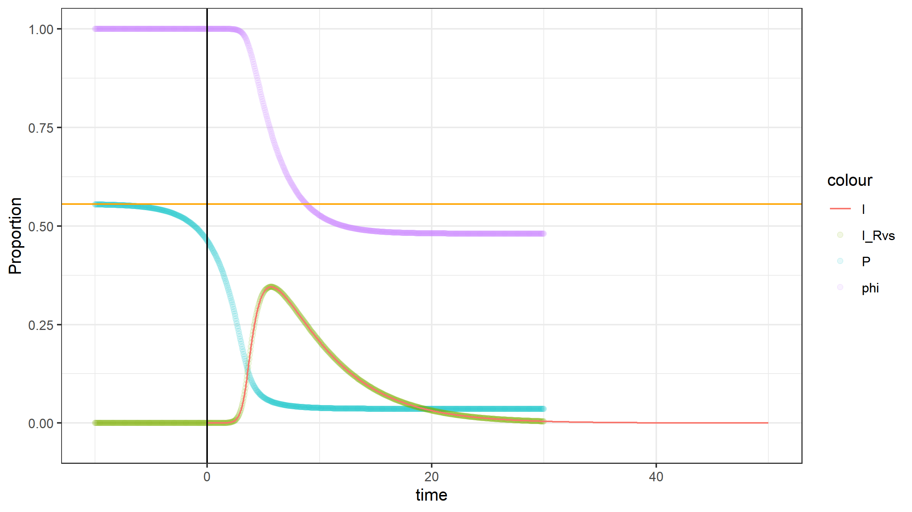

We would like to derive the "eigenvector" initial condition for $R(0)$ and a small enough $\phi(0)$, such that $$\mathcal{R}_{i,0}=\mathcal{R}_i(0)=\max(\mathcal{R}_i)$$ as in [NoteForR_i](./NoteForR_i.md).

We start with MSV ODE system:
$$\begin{cases}
    S(t)=G_p(\phi(t))
    \\
    I(t)=1-S(t)-R(t)
    \\
    \dot{R}(t)=\gamma I(t)
\end{cases}$$
$$\dot{\phi}=-\beta\phi_I=-\beta(\phi-\phi_S-\phi_R)=-\beta\phi+\beta\frac{G_p'(\phi)}{\delta}+\gamma(1-\phi)$$where $\phi(t)$ is the probability that a randomly chosen edge has not yet transmitted the disease at time $t$.
At $t=0$, $\phi(0)\rightarrow 1$ so we take 
- $\omega=1-\phi \Leftrightarrow \phi=1-\omega$ 
- $V(t)=1-S(t)=1-G_p(\phi(t))=1-G_p(1-\omega(t))$

Now consider the ODE for $\omega(t)$ and $R(t)$ based on previous system, we have 
$$\begin{cases}
	\dot{\omega}=-\dot{\phi}=\beta(1-\omega)-\beta\frac{G_p'(1-\omega)}{\delta}-\gamma\omega
    \\
    \dot{R}(t)=\gamma (1-G_p(\phi(t))-R(t))
\end{cases}$$

Similar with the derivation of $\mathcal{R}_{c,0}$, using first order approximation, we have:
$$\begin{align}
G_p(\phi(t))&= G_p(1-\omega(t)) = \sum_kp_k(1-\omega)^k
\\
& =\sum_k p_k [1-k\omega+o(\omega^2)]
\\
& \approx \sum_k p_k- \omega\sum_k k p_k
\\
&= 1-\delta\omega
\end{align}$$
and
$$\begin{align}
G'_p(\phi(t))&= G'_p(1-\omega(t)) = \sum_k k p_k(1-\omega)^{k-1}
\\
& =\sum_k k p_k [1-(k-1)\omega+o(\omega^2)]
\\
& \approx \sum_k k p_k- \omega\sum_k k(k-1) p_k
\\
&= \delta(1-\frac{G''_p(1)}{\delta}\times\omega)
\end{align}$$

Using these approximation, the linearized ODEs near $t \rightarrow 0$ are
$$\begin{cases}
	\dot{\omega}\approx \beta(1-\omega)-\beta(1-\frac{G''_p(1)}{\delta}\times\omega)-\gamma\omega=[\beta\times\frac{G''_p(1)}{\delta}-(\beta+\gamma)]\omega=\eta\omega
    \\
    \dot{R}(t)\approx\gamma (\delta\omega-R(t))
\end{cases}$$
- Note: $$\eta=\beta\times\frac{G''_p(1)}{\delta}-(\beta+\gamma)=(\beta+\gamma)(\mathcal{R}_{c,0}-1)$$
Then this linearized system has the matrix form:
$$
\begin{bmatrix}
\dot{\omega}
\\
\dot{R}
\end{bmatrix}
=\begin{bmatrix}
\eta & 0
\\
\delta\gamma & -\gamma
\end{bmatrix} \times
\begin{bmatrix}
\omega\\
R
\end{bmatrix} 
$$

The eigenvalues are just $\eta$ and $-\gamma$.

For the dominant eigenvalue $\eta$, the eigenvector satisfy:
$$
\begin{bmatrix}
0
\\
0
\end{bmatrix}
=\begin{bmatrix}
0 & 0
\\
\delta\gamma & -\gamma-\eta
\end{bmatrix} \times
\begin{bmatrix}
\omega(0)\\
R(0)
\end{bmatrix} 
\Leftrightarrow
R(0)=\frac{\delta\gamma}{\gamma+\eta}\times\omega(0)
$$
This should give us a initial condition on the eigen-direction.

### Migrating to $p(0)$
Based on Todd's [Rc.tex](./Rc.tex)/[Rc.pdf](./outputs/Rc.pdf) note, we have an additional ODE for $p(t)$: the probability of a newly infected nodes infect one of its neighbour before recovery.
$$\frac{d}{dt}p(t)=-\beta \phi_S(t)+(\beta+\gamma)p(t)=-\beta \frac{G''_p(\phi(t))}{\delta}+(\beta+\gamma)p(t)$$

We have conclude this should be a final value problem, since when $t\rightarrow +\infty$, $\frac{d}{dt}p(\infty) \rightarrow 0$ as the system reaching its equilibrium state.

Then we could derived the $\mathcal{R}_c$ using $p(t)$:
$$\mathcal{R}_c(t)=\frac{p(t)}{\phi(t)} \times (\mathbb{E}[K_I^*]-1)=p(t)\times\frac{G''_p(\phi(t))}{G'_p(\phi(t))}$$
**TP, RZ and JD have some (not resolved?) issue for the $\frac{\phi(t)}{p(t)}$ term**, but this derivation seems fits well with simulation:
For $N=50,000, \gamma=0.20, \beta=0.25, I_0=1$: 16 simulation 

However, as observed in the simulation, network size $N$ not large enough (and $\gamma$ is small, infectious duration is long), there is a good possibility that competing infection occurs, even for nodes infected at $t\rightarrow0$ but being infectious for a long time, s.t. $$\frac{d}{dt}p(t)|_{t=0}\neq 0 \Leftrightarrow p(0)\neq \frac{\beta}{\beta+\gamma}$$
But we could still say $$p(-\infty)=\frac{\beta}{\beta+\gamma}$$
Currently, we reversely solve the ODEs from some $t_{end}$ that close to the end of the outbreak for $p(t)$.
For $N=500,000, \gamma=0.20, \beta=0.25, I_0=1$

In [Rc.tex](./Rc.tex)/[Rc.pdf](./outputs/Rc.pdf), Todd tried to estimate $p(0)$ using linearization. We are also interested to know how $p(0)$ connects to $N$, so we have a better idea for how large the network should be so that competing infection could be rear, at least at the very beginning s.t. $$p(0)\approx\frac{\beta}{\beta+\gamma} \Leftrightarrow \mathcal{R}^*_c(0)\approx\mathcal{R}_c(0)$$

As an alternative way, we would like to see if we can use similar "eigendirection" idea to estimate $p(0)$ like $R(0)$.
- But RZ doubt if it works, especially for larger $\rho=\frac{\beta}{\gamma}$ case where $\frac{d}{dt}p(t)|_{t=0}$ seems to be quite different with $\frac{d}{dt}p(t)|_{t=-\infty}$. 
- Increasing $N$ seems lower $\omega(0)$ and make $p(0)$ closer to $p(-\infty)$.

Consider $q(t)=\frac{\beta}{\beta+\gamma}-p(t)$, then$$\dot{q}(t)=\frac{d}{dt}q(t)=-\frac{d}{dt}p(t)=+\beta \frac{G''_p(\phi(t))}{\delta}-(\beta+\gamma)(\frac{\beta}{\beta+\gamma}-q(t))$$
Thus as $q\rightarrow 0$ and $\omega\rightarrow 0$, the linearized ODEs as $t\rightarrow -\infty$ are
$$\begin{cases}
	\dot{\omega}\approx \beta(1-\omega)-\beta(1-\frac{G''_p(1)}{\delta}\times\omega)-\gamma\omega=[\beta\times\frac{G''_p(1)}{\delta}-(\beta+\gamma)]\omega=\eta\omega
    \\
    \dot{q}\approx +\beta(1-\frac{G''_p(1)}{\delta}\omega)-(\beta+\gamma)(\frac{\beta}{\beta+\gamma}-q)=-\beta\frac{G''_p(1)}{\delta}\omega+(\beta+\gamma)q
\end{cases}$$
- Note: $$\eta=\beta\times\frac{G''_p(1)}{\delta}-(\beta+\gamma)=(\beta+\gamma)(\mathcal{R}^*_{c}(0)-1)$$
Then this linearized system has the matrix form:
$$
\begin{bmatrix}
\dot{\omega}
\\
\dot{q}
\end{bmatrix}
=\begin{bmatrix}
\eta & 0
\\
-\beta\times\frac{G''_p(1)}{\delta} & \beta+\gamma
\end{bmatrix} \times
\begin{bmatrix}
\omega\\
q
\end{bmatrix} 
$$

The eigenvalues are just $\eta$ and $\beta+\gamma$.

For most cases that $\mathcal{R}^*_{c}(0)=\frac{\beta}{\beta+\gamma}\frac{G''_p(1)}{\delta}>2$, the dominant eigenvalue is $\eta$, the eigenvector satisfy:
$$
\begin{bmatrix}
0
\\
0
\end{bmatrix}
=\begin{bmatrix}
0 & 0
\\
-\beta\times\frac{G''_p(1)}{\delta} & (\beta+\gamma)-\eta
\end{bmatrix} \times
\begin{bmatrix}
\omega(0)\\
q(0)
\end{bmatrix} 
\Leftrightarrow
q(0)=\frac{\beta\times\frac{G''_p(1)}{\delta}}{(\beta+\gamma)-\eta}\times\omega(0)<0
$$
(???)