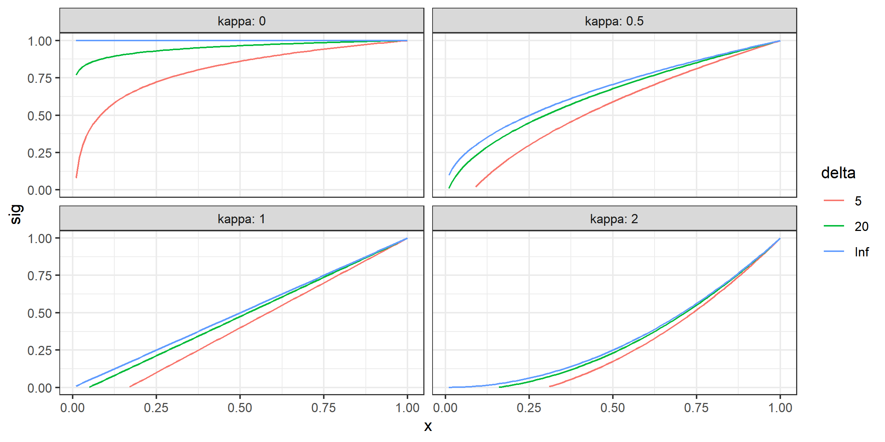

## 1. MSV type network model
Network model formalized by [J.C. Miller, A.C. Slim & E.M. Volz(2011)](./refs/MillerSlimVolz2011.pdf).
Result agreed with a recent paper by [RomanescuEtAL(2023)](https://doi.org/10.1016/j.epidem.2023.100708)  and [Novozhilov(2008)](./refs/Novozhilov2008.pdf)

Quick Summary: [approaches.md](./approaches.md)

#### (To Do) Assumptions
1. Neighbors are independent
2. Infinite size random network: a.s. no loop network

#### MSV Network Framework
Consider a random network model that model a population 

- Vertices represent individual in the population
	- **Network size**: Number of vertices in the network $N$, also the population size
	- **Degree**: Number of edges connected to each vertex
- Edges are connections that allow transmission between two individuals.
	- **Undirected**: As the frame work is build on random network without specifying any structure other than degree distribution, the edges are undirected, as the transmission can go both way, depends on which side is infected first.
	- **Simple Network**: All edges are evenly weighted and at most one edges can exit between any two vertices. 
- A **static network**:
	- Degree of each vertex is invariant w.r.t. time once assigned
	- Edges is invariant w.r.t. time once formed
- A **configuration model**:
	- A algorithm to form static random network that 
		- First assigning **stubs**(aka half edges) to each vertices based on degree distribution.
		- Then **uniformly randomly** paring all existing stubs into edges until no stubs are remained.
		- Reject all graph/network that have multiple edges among any given pair of vertices.
	- The successful graph are kept as a **realization**
		- Not all degree sequence (as a random sample of degree distribution) are **realizable**. 
		- Theorem by P. Erdös and T. Gallai gives the necessary and sufficient conditions for a degree sequence to be realizable.
	- This algorithm guaranteed that all possible realization have same probability to be generated (uniformly randomly realization), which is mathematically necessary for the mean field result to hold.
	- All algorithm that guarantee uniformly randomly realization should work, but the Configuration model is the earliest, most intuitive and famous one.
		- However, a draw back is the generating efficiency.
		- It is still remain an open discussion ([Greenhill, 2021](https://www.cambridge.org/core/books/surveys-in-combinatorics-2021/generating-graphs-randomly/AF8E08B99555E31A6AF1BAEB754911EC)) in random graph field to have a efficient algorithm that guarantee or approximately guarantee the uniformness.
		- Several algorithm exist but each with some drawbacks.

For random distribution given a degree distribution with PDF: $\mathbb{P}(K=d)=p_d$.
The probability generating function(PGF) of degree distribution is denoted by:
$$G_p(x)=\sum_{d=0}^{\infty}p_d x^{d}$$
- A useful expression would be the mean degree $\delta$ is given by:
$$\delta=\sum_{d=0}^{\infty}p_d d=\frac{d}{dx}G_p(x)|_{x=1}=G_p'(1)$$

Also for network model, **Excess degree** could also be important, as during the outbreak, any newly infected vertex with degree $k$ could only infect at most $k-1$ of its susceptible neighbors, as its infection must come from one neighbor that already being infected.
Based on given degree distribution with PDF $p_d$, we could define the distribution of excess degree with PDF denoted by $q$, such that:$$\mathbb{P}(\text{excess degree}=d-1)=q_{d-1}=\frac{p_d d}{\sum_{k=0}^{\infty}p_k k}=\frac{p_d d}{\delta}$$
The corresponding PGF for excess degree is $$G_q(x)=\frac{G_p'(x)}{\delta}$$

Following [J.C. Miller, A.C. Slim & E.M. Volz(2011)](./refs/MillerSlimVolz2011.pdf)(MSV), at any moment $t$ we define $\phi(t)$ ($\phi$ in MSV paper):
- (MSV definition) the probability that randomly chosen neighbor vertex $b$ of a randomly chosen vertex $a$ has not yet transmit the infectious to $a$.
- (JD definition) the probability of a randomly chosen edge in the network has not yet transmit infection. Let $\phi=1-\phi$ be the probability that the infection has transmitted.

==MSV claim for a random network with large enough size, neighbors of a randomly chosen vertex $a$ are independent, which could be a key assumption for the framework to work in large size network.== 
Given its degree $d$, vertex $a$ is susceptible at time $t$ with probability $s(d; \phi(t)) = \phi(t)^d$.
Therefore, the proportion of susceptible vertex $S(t)$ at time $t$ is given by:
$$S(t)=G_p(\phi(t))=\sum_{d}p_d \phi(t)^d$$
Now for the vertices compartment, one can write a system such that:

$$
    \begin{cases}
      S(t)=G_p(\phi(t))
      \\
      I(t)=1-S(t)-R(t)
      \\
      \dot{R}(t)=\gamma I(t)
    \end{cases}
$$

Note: Here $\theta=\phi$ as I am using MSV's figure directly

Now to find the ODE that governs $\phi(t)$, we consider the 4 compartment of all edges/neighbor of a randomly chosen vertex $a$:
- $\psi(t)=1-\phi(t)$: the proportion/probability that a neighbor $b$ is infected and the infection has transmitted to $a$.
- $\phi_S$: the proportion/probability that a neighbor $b$ is susceptible. Given degree $d$, $b$ is susceptible with probability $\phi(t)^{d-1}$ (not consider transmission from $a$ so $d-1$ nodes can infect $b$). A weighted average based on excess degree gives
$$\phi_S=\sum_dq_{d-1} \phi(t)^{d-1}{}=\frac{G'(\phi)}{G'(1)}=\frac{G'(\phi)}{\delta}$$
- $\phi_I$: the proportion/probability that a neighbor $b$ is infected but the infection has not yet transmitted to $a$.
- $\phi_R$: the proportion/probability that a neighbor $b$ is recovered but the infection has not transmitted to $a$.
- As we have a closed system, we have 
$$1=(1-\phi)+\phi_S+\phi_I+\phi_R \Leftrightarrow\phi=\phi_S+\phi_I+\phi_R$$
- Consider the infection rate $\beta$, the flux from $\phi_I$ to $1-\phi$ will be $\beta \phi_I$, this gives: 
$$\frac{d\phi(t)}{dt}=\dot{\phi}=-\beta\phi_I=-\beta(\phi-\phi_S-\phi_R)$$
- Consider the recovery rate $\gamma$, the flux from $\phi_I$ to $\phi_R$ will be $\gamma \phi_I$, this gives:
$$\dot{\phi}_R=\gamma\phi_I$$
- As $\phi_R(0)$ and  $1-\phi(0)$ both close to $0$, with the large network size, we have the integration:
$$\phi_R=\frac{\gamma}{\beta}(1-\phi)$$
- Therefore we combine these results got to:
$$\dot{\phi}=-\beta\phi_I=-\beta(\phi-\phi_S-\phi_R)=-\beta\phi+\beta\frac{G_p'(\phi)}{\delta}+\gamma(1-\phi)$$

MSV named $\mathcal{R}_{0,c}$ as **basic reproductive number** and use the same notation as in homogeneous model.
However, its idea and definition is differ from intuitive understanding of $\mathcal{R}_0$ for homogeneous model.

They define of $\mathcal{R}_{0,c}$ from network approach first: $\mathcal{R}_{0,c}$ is the expected number of infections a ==newly== infected vertex causes.
This gives the expression: 
$$
\begin{align}
\mathcal{R}_{0,c}&=\sum_{d=1} q_{d-1} \times(d-1)\times \frac{\beta}{\beta+\gamma}
\\
&= \frac{\beta}{\beta+\gamma} \sum_{d=1} \frac{p_d \times d}{\delta} \times(d-1)
\\
&=\frac{\beta}{\beta+\gamma} \frac{\sum_{d=1} p_d \times d \times(d-1)}{\delta}
\\
&=\frac{\beta}{\beta+\gamma} \times\frac{G''_p(1)}{\delta}=\frac{\beta}{\beta+\gamma} \times\frac{G''_p(1)}{G'_p(1)}
\end{align}
$$
- $q_{d-1}$ and $d-1$ comes from the fact that a newly infected vertex must have its infector, which can no longer be infected.
- $T=\frac{\beta}{\beta+\gamma}$ is the per-edge probability that transmission really happen, i.e. the probability a vertex infects one of its neighbor prior to recovering.
- As they assume neighbors are independent, then the number of neighbors that will be infected by an infected vertex with degree $d$ will follow a binomial distribution $\text{Binom}(d-1,\frac{\beta}{\beta+\gamma})$ at $t=0$, so the expectation would just be $(d-1)\times \frac{\beta}{\beta+\gamma}$ 

They then provide an equivalent derivations based on the ODE of $\phi$:
Consider $\phi(0)=1+\epsilon$ ($\epsilon<0$)which is very close to $1$:
$$\dot{\phi}=\dot{\epsilon}=-\beta(1+\epsilon)+\beta\frac{G_p'(1+\epsilon)}{\delta}+\gamma (1-(1+\epsilon))$$
Consider the first order: 

$$
\begin{align}
G_p'(1+\epsilon)&=\sum_d p_d d(1+\epsilon)^{d-1}
\\
&= \sum_d p_d d (1+(d-1)\epsilon+o(\epsilon))
\\
& \approx\sum_d p_d d+\sum_d p_d d(d-1)\epsilon
\\
&= \delta+\epsilon\sum_d p_d d (d-1)
\\
& = \delta+\epsilon G_p''(1)
\end{align}
$$

Then for the first order we have:
$$\dot{\phi}=\dot{\epsilon}\approx-\beta(1+\epsilon)+\beta\frac{\delta+\epsilon G_p''(1)}{\delta}-\gamma\epsilon=[-(\beta+\gamma)+\beta\frac{G_p''(1)}{\delta}] \times \epsilon$$
For the outbreak, $\mathcal{R}_{0,c}= \frac{\beta}{\beta+\gamma} \frac{G''_p(1)}{\delta}>1 \Leftrightarrow \frac{\dot{\epsilon}}{\epsilon}=[-(\beta+\gamma)+\beta\frac{G_p''(1)}{\delta}]>0$ 

More precisely, since $\dot{\phi}=-\beta\phi_I$, we can further have:
$$\dot{\phi_I}=[-(\beta+\gamma)+\beta\frac{G''_p(\phi)}{\delta}] \phi_I$$

## 2. Jonathan-Richard result (Zhao1)

This result is not really situated inside this framework, although it was inspired by it. 
If we imagine that both the number of susceptible and their mean susceptibility are shaped by a uniform probability of transmission on each edge, then we can solve for each of them in terms of this probability, and consider the relationship between number of susceptible and total susceptibility of the population as a possible functional form for phenomenological heterogeneity.

Consider the effective "incidence" term using 

$$\rho=\frac{\mathcal{R}_{c}}{\mathcal{R}_{0,c}}$$ 
Follow JD's idea: 

$$\rho=\frac{\mathcal{R}_{c}}{\mathcal{R}_{0,c}}=\frac{\sigma_{\phi}}{\sigma_0}$$
- $\sigma_{\phi}$: Expected number of edges of susceptible vertices
$$\sigma_{\phi}=\sum_{d=0}^{\infty}p_d \times d \times(1-\phi)^{d}=\sum_{d=0}^{\infty}p_d \times d \times \phi^{d}=\phi\sum_{d=0}^{\infty}p_d \times d \times\phi^{d-1}=\phi G_p'(\phi)$$
- At $t=0$, we have $\sigma_\phi(0)=\sigma_0$: 
$$\sigma_0=\lim_{t\rightarrow0}\sigma_{\phi}=\lim_{\phi\rightarrow1} \phi G_p'(\phi)=\delta$$
- Therefore, 
$$\rho=\frac{\phi G_p'(\phi)}{\delta}$$

Consider the Negative binomial distribution as degree distribution, which could also be seen as a continuous mixture of Poisson distribution and Gamma distribution.
For this family of distributions (Negative Binomial, Poisson, Geometric), the PGF $G_p$ could be written easily in closed form and the distributions are connected such that other distributions could be deduced from the Negative Binomial distribution.

Typical PMF of negative binomial distribution is given by:
$$p_d=\binom{d+r-1}{d}(1-p)^dp^r$$ with mean 
$$\delta=\frac{r(1-p)}{p}$$ and variance 
$$\text{Var}=\frac{r(1-p)}{p^2}$$
For better understanding, we parameterize the distribution using mean $\delta$ and Dushoff-style squared CV $\kappa$, such that 

$$
\begin{align} 
	r & =\frac{1}{\kappa}
	\\
	p & =\frac{1}{1+\kappa\delta}
\end{align}
$$

This gives us the variance $\text{Var}=\delta(1+\kappa\delta)>\delta$, as these family of distributions are always over-dispersed, and further never converge to homogeneous case.

Now consider the PGFs of this family:
- Negative Binomial distribution:
$$G_p(\phi)=(\frac{1}{1+\kappa\delta-\phi\times\kappa\delta})^{\frac{1}{\kappa}}$$
- Poisson: As $\kappa \rightarrow 0$, NegBinom converge to Poisson distribution with 
$$G_p(\phi)=e^{\delta(\phi-1)}$$
	- Verification: As 
	$$\lim_{a\rightarrow \infty}(1+\frac{x}{a})^a=e^x =\lim_{b\rightarrow0}(1-x \times b)^{-\frac{1}{b}}$$we have
	$$\lim_{\kappa\rightarrow 0} (\frac{1}{1+\kappa\delta-\phi\times\kappa\delta})^{\frac{1}{\kappa}}=\lim_{\kappa\rightarrow 0} (1-\kappa \times\delta(\phi-1))^{-\frac{1}{\kappa}}=e^{\delta(\phi-1)}$$
- Geometric: As $\kappa=1$, NegBinom is Geometric distribution by definition, with PGF: 
$$G_p(\phi)=\frac{1}{1+\delta-\phi\times\delta}$$

Just consider the general Negative Binomial case, as from the MSV framework, we got
$$S=G_p(\phi)=(\frac{1}{1+\kappa\delta-\phi\times\kappa\delta})^{\frac{1}{\kappa}}\Rightarrow\phi=G^{-1}_p(S)=1+\frac{1-S^{-\kappa}}{\kappa\delta}$$
and 
$$G'_p(\phi)=(\frac{1}{1+\kappa\delta-\phi\times\kappa\delta})^{\frac{1}{\kappa}}\times\frac{\delta}{1+\kappa\delta-\phi\times\kappa\delta}=\frac{S\delta}{1+\kappa\delta-\phi\times\kappa\delta}$$
Take this into $\rho$ gives us for Negative Binomial:
$$
\begin{align}
\rho&=\frac{\mathcal{R}_{\text{eff}}}{\mathcal{R}_{0,c}}=\frac{\phi G'_p(\phi)}{\delta}=\frac{S\phi}{1+\kappa\delta-\phi\times\kappa\delta}
\\
&=S\times \frac{1+\frac{1-S^{-\kappa}}{\kappa\delta}}{1+\kappa\delta-(1+\frac{1-S^{-\kappa}}{\kappa\delta})\kappa\delta}
\\
&=S\times(S^{\kappa}+\frac{S^{\kappa}-1}{\kappa\delta})
\end{align}
$$

- Gamma: as $\delta \rightarrow \infty$ we have 
$$\lim_{\delta\rightarrow\infty}\rho=S\lim_{\delta\rightarrow\infty}(S^{\kappa}+\frac{S^{\kappa}-1}{\kappa\delta})=S \times S^{\kappa}$$ which agree with the Dwyer-Parsons result with Gamma distribution
- Poisson: as $\kappa\rightarrow0$ we have
$$\lim_{\kappa\rightarrow0}\rho=S\lim_{\kappa\rightarrow0}(S^{\kappa}+\frac{S^{\kappa}-1}{\kappa\delta})=S \times (1+\frac{\log(S)}{\delta})$$which agree with [Novozhilov(2008)](./refs/Novozhilov2008.pdf) and [RomanescuEtAL(2023)](https://doi.org/10.1016/j.epidem.2023.100708) result with Poisson distribution.
	- Derivation: 
	$$\lim_{\kappa\rightarrow0}\frac{S^{\kappa}-1}{\kappa}=\log(S)$$as $S \in [0,1]$
- Geometric: as $\kappa=1$ we have 
$$\rho=S\times(S+\frac{S-1}{\delta})$$which agree with [RomanescuEtAL(2023)](https://doi.org/10.1016/j.epidem.2023.100708) result with Geometric distribution.
	- Derivation: They use a weird parameterization (maybe since they rely more on PMFs instead of PGFs) such that $p=1-e^{1/a} \Rightarrow \delta=\frac{e^{-1/a}}{1-e^{-1/a}}$. Take this into $\rho$ provides their result.

For further illustration, we define 
$$\sigma(S)=\frac{\rho}{S}$$and present the $\sigma(S)$ curve on $[0,1]$ for the distributions mentioned and different $\delta$ and $\kappa$ value. Note the horizontal line at $\sigma\equiv1$ represent the homogeneous case.

****

However, JD and RZ doubt this results should only work in a directed network.
==TODO: what kind of network/assumptions do we need for this result to work, as it is related to call known results==

A conjecture now is this apply for a network where in-degree is negative-binomial distributed while the directed edges towards each nodes is uniformly randomly connected to all other nodes. 
But it might not be that interesting.

==Idea: Derive this from Novozhilov Framework, even if discrete distribution does not fit well with their assumption: parametric heterogeneity of susceptibility==

## 3. Romanescu Approach (Zhao2 Result)
A problem for Jonathan-Richard formula is the derivation of $\rho$ might not fit with the MSV network framework properly as it lacks of locality.

[RomanescuEtAL(2023)](https://doi.org/10.1016/j.epidem.2023.100708) and [RomanescueDeardon(2017)]([https://doi.org/10.1111/sjos.12270](https://doi.org/10.1111/sjos.12270)) provides an alternative derivation, which derive the same $\rho$ results based on MSV network for the same family of degree distribution with consideration of network locality. (These papers are not really well-written, especially the 2017 one which contains more derivation.)

However, equivalent result of the two approaches only happens on the negative-binomial family, as $\frac{G_p(x)}{G'_p(x)}$ is linear on $x$, which is the property of this distribution family.

After reading their derivation, RZ think they might made some mistake but the idea is still valuable.
### Follow [RomanescuEtAL(2023)](https://doi.org/10.1016/j.epidem.2023.100708): 
Define $\mathcal{R}^*_c(t)$ to be the expected number of secondary infections for a ==newly?== infected individual $X_t$ at tim\mathcal{R}^*_c_{\text{eff}}(t)=\mathbb{E}[X_t]$. 

To derive $X_t$
- $K_S(t)$ is the random variable of degree of a random susceptible vertex at time $t$
	- Proportion of susceptible vertices with degree $k$ at time $t$ in the entire population $p^S_k(t)=p_k \phi^k$
	- Total proportion of susceptible nodes at time $t$ is $S(t)=G_p(\phi(t))$
	- Corresponding PGF of $K_S(t)$ is $G_{S}(x)=\frac{G_p(x \phi)}{G_p(\phi)}=\frac{G_p(x \phi)}{S}$
- Observe the process by which a susceptible individual becomes infected. 
	- Consider a random edge that has the potential to transmit infection at time $t$, which is an $S-I$ pair: The uninfected individual at the end of this edge is chosen from the susceptible set, but not at random: an individual's chance of being selected is proportional to their degree, in the absence of higher-order features. 
	- Thus, the relative frequency of an individual of degree $k$ becoming infected at the next time step is proportional to $k p^S_k(t)=k p_k \phi^k$.
- $K_I^*(t)$ is the random variable of degree of a newly infective vertex at time $t$
	- Corresponding PGF of $K_I^*(t)$ is $$\frac{\sum_k k p_k\phi^kx^k}{\sum_k k p_k\phi^k}=\frac{xG'_S(x)}{G
	'_S(1)}=G_I(x)$$
	- Expectation of $K_I^*(t)$ is:$$\mathbb{E}(K_I^*(t))=G_I'(1)=\frac{\phi G_p''(\phi)}{G'_p(\phi)}$$
- Since neighbors are assumed to be independent, given the a ==newly infected== vertex have degree $K_I^*(t)$, the number $X_t$ of new infective vertices infected by this vertex is distributed as a Binomial($n=K_I^*(t)-1,\mu$).
	- $n=K_I^*(t)-1$ is because we know for any infective vertex, it can no longer infect its infector.
	- [RomanescuEtAL(2023)](https://doi.org/10.1016/j.epidem.2023.100708) claim that $\mu= \frac{\beta}{\beta+\gamma} S(t)$ where $\frac{\beta}{\beta+\gamma}$ is the per-edge infection probability/transmissibility and on average, only a fraction $S(t)$ of its contacts will still be susceptible.
	- ==RZ believe here they might make a mistake here, since this $\mu$ probability should correspond to edge-forming process, where the probability should related to the proportion of edges connected to $S$ vertices, not the proportion of $S$ vertices.==
	- ==They did not explicitly state that this derivation also assume that every edge connect to this $I$ vertex are still being able to transmit the infection other than the known one connect to its infector. This is the same to assume the vertex is newly infected and not yet infect any others.
	- An correction would be $\mu=\frac{\beta}{\beta+\gamma}\times \frac{\phi_S}{\phi}$ if we considering that the vertex is newly infected, where $\frac{\phi_S}{\phi}$ is the probability that an edge is connected to a susceptible node given that it has not transmitted infection.
- Therefore, with law of total expectation, for a randomly newly infected node we know the expectation number $X_t$ of infected vertices it can generate would be:
$$
\begin{align}
\mathcal{R}^*_c=\mathbb{E}[X_t]&=\mathbb{E}_{K_I^*}[\mathbb{E}[X_t|K_I^*]]
\\
& =\mathbb{E}_{K_I^*}[\mu(K_I^*-1)]
\\
& =\mu \mathbb{E}[K_I^*-1]
\\
& = \mu (\mathbb{E}[K_I^*]-1)
\\
& = \mu \phi\frac{G''_p(\phi)}{G'_p(\phi)}
\end{align}
$$

Take into the idea that $$\mu=\frac{\beta}{\beta+\gamma}\times \frac{\phi_S}{\phi}=\frac{\beta}{\beta+\gamma}\times\frac{G'_p(\phi)}{\phi G'_p(1)}$$, we have:$$\mathcal{R}^*_c=\frac{\beta}{\beta+\gamma}\frac{G''_p(\phi)}{\delta}$$
As $t\rightarrow 0 \Leftrightarrow \phi \rightarrow 1$, $\mathcal{R}^*_c$ converge to $$\mathcal{R}_{0,c}=\frac{\beta}{\beta+\gamma}\frac{G''_p(1)}{\delta}$$
Similar as how MSV verifying their $\mathcal{R}_{0,c}$ with dynamic, $\mathcal{R}^*_c=1$ is where $\dot{\phi}_I=0$. which verify the definition.

#### Negative Binomial Family of Degree Distribution
(TO DO: Applying this for all NegBinom distribution family)

Similarly with previous Jonathan-Richard result, for Negative binomial degree distribution with PGF:$$G_p(\phi)=(\frac{1}{1+\kappa\delta-\phi\times\kappa\delta})^{\frac{1}{\kappa}}=S$$we have:
$$\sigma=\frac{\mathcal{R}^*_c}{\mathcal{R}_{0,c}\times S}=\frac{\frac{\beta}{\beta+\gamma}\frac{G''_p(\phi)}{\delta}}{\frac{\beta}{\beta+\gamma}\frac{G''_p(1)}{\delta}\times G_p(\phi)}=\frac{G''_p(\phi)}{G''_p(1) G_p(\phi)}=\frac{\delta^2(\kappa+1)G_p(\phi)^{2\kappa+1}}{\delta^2(\kappa+1)G_p(\phi)}=S^{2\kappa}$$
as we have
$$G'_p(\phi)=(\frac{1}{1+\kappa\delta-\phi\times\kappa\delta})^{\frac{1}{\kappa}}\times\frac{\delta}{1+\kappa\delta-\phi\times\kappa\delta}=\frac{S\delta}{1+\kappa\delta-\phi\times\kappa\delta}$$
and
$$G''_p(\phi)=\delta^2(\kappa+1)(\frac{1}{1+\kappa\delta-\phi\times\kappa\delta})^{\frac{1}{\kappa}+2}=\delta^2(\kappa+1)S^{2\kappa+1}$$
==(TODO) verify the gamma case==

### Todd's Question about Zhao2 and $\mathcal{R}^*_c$
TP think we need to be more careful for the probability $\mu$ here, by setting
$$\mu = \frac{\beta}{\beta+\gamma}\times \frac{\phi_S}{\phi}$$
, we assume 
- All neighbors of the focal, newly infected nodes are independent
- The connected susceptible node is susceptible during the whole infection period, i.e. not infected by its any other neighbors: $$\frac{\beta}{\beta+\gamma}$$but this is not necessarily true in real world.
- **Here $\mu$ is overcounting**: it assumes every susceptible neighbor of the focal newly infected node will be infected by the focal. 
- There should be a certain portion of susceptible nodes infected by their other neighbors.
	- Idea: the negative adjustment term in $-\ddot{S}$?
	- ?? This over counting is small when the network is large and $\phi_I$ is not too large
	- Are we subtracting things more than ones? Be careful
- It requires more consideration how the independency works.
We need to find the true effective number of infection by case $\mathcal{R}_c$.
Current conjecture for its form would be:
$$\mathcal{R}_c=(\frac{\beta}{\beta+\gamma}-\omega(t))\times\frac{\phi_S}{\phi}\times\mathbb{E}[K^*_I-1]$$
with the competing factor $\omega(t)$ measures the probability that susceptible neighbors of the infected focal vertex are infected by other infected vertices before the focal node recovered.
- TODO: find $\omega(t)$

### How $\mathcal{R}^*_c$ affect the incidence $-\dot{S}(t)$?
Consider rate of change for the incidence term
$$
\begin{align}
\frac{d}{dt}(-\dot{S}(t))& =-\ddot{S}(t)
\\
& =\beta\delta[\phi_S\dot{\phi}_I+\dot{\phi}_S\phi_I]
\\
& =\beta\delta[\phi_S\phi_I(\beta+\gamma)(\mathcal{R}^*_c-1)-\beta\frac{G''_p(\phi)}{\delta}\phi_I^2]
\\
& =\beta\delta\phi_I[\phi_S(\beta+\gamma)(\mathcal{R}^*_c-1)-\beta\frac{G''_p(\phi)}{\delta}\phi_I]
\end{align}
$$
If and only if $(\mathcal{R}^*_c-1)$ >0, the rate of change $-\ddot{S}(t)$ have positive term (increasing force).

## 4. $\mathcal{R}_{c}$ and $\mathcal{R}_{i}$ for network model
### Question
(??) How to connect $\mathcal{R}_{i}$ with incidence term $-\dot{S}(t)$? $$\mathcal{R}_{i}=-\frac{-\dot{S}(t)}{I(t)}\times\frac{1}{\gamma}$$
- ==This does not work for Miller's network model==
- ==(TODO: We need further understanding this and give explanation)==

==(TODO: How to estimate the Def/Black curve here?)==
Observation: for Poisson degree distribution, the peak value seems to be $(\delta-1)\frac{\beta}{\gamma}$. 

Recent paper by [G.A. Rampala(2023)](https://arxiv.org/abs/2310.13866) discussed about that for Poisson network, the MSV dynamic is equivalent to dynamic from a homogeneous SIR-like ODE system , but with modification. I have verified his result.
$$
\begin{align}
	\dot{S}& = -\beta\delta SX_D
	\\
	\dot{X}_D & = -\dot{S}-(\beta+\gamma)X_D
	\\
	\dot{I} & = -\dot{S}-\gamma I
	\\
	\dot{R} & = \gamma I
\end{align}
$$
This indicate that incidence term $\dot{S}$ in network model is not directly determined by $I$.
Note, $X_d$ curve converge to $I$ as $\delta \rightarrow \infty$ with the same $\mathcal{R}_{0,c}$.

### Some thoughts
For MSV network frame with configuration network, I don't think the relationship of reproductive number/ratio and $\dot{S}$ from homogeneous model, like:
$$\mathcal{R}_{i}=-\frac{-\dot{S}(t)}{I(t)}\times\frac{1}{\gamma}$$
can be directly applied. $\mathcal{R}_{i}$ defined as (expected) number of infection a randomly chosen infected individual can cause, which affect the incidence of the system.

For homogeneous model, any individual in $I(t)$ have same infectivity to infect susceptible nodes, because of the fully-mixed mass-action assumption for contact. 
In such case, every infected individual has the same infectivity like any individual in $I(t)$, so the $\mathcal{R}_{i}$ is proportion to new incident $\dot{S}(t)$ averaged on $I(t)$, i.e. the incident is governed by $\mathcal{R}_{i} \times I(t)$

(??) However, this assumption might be less justifiable on MSV network frame with heterogeneity in contact. 

Consider transmission on configuration network, it is possible to have an vertex in the $I(t)$ compartment while no longer being able to transmit infection to any of its neighbor at the moment $t$, i.e. all of its neighbor are not susceptible at and after time $t$.
An obvious example would be infected vertex with degree one, whose only neighbor will be its infector and thus not being able to transmit the infection to any other vertices.
Unlike homogeneous case, such vertices are counted in $I(t)$ but contribute nothing to new infections, and also flow to $R$ compartment with same rate as those infected vertices with transmission potentials.
Similar arguments about contact heterogeneity applies to other vertices in $I$, where their heterogeneity in degree affect the their infection potential, but cannot be represented by just the proportion $I(t)$, as it is easily to see that degree distribution of infected nodes is not invariant with time.

Therefore, the incidence $$\dot{S}(t)=G_p'(\phi) \dot{\phi}=- \beta G_p'(\phi) \phi_I$$might not simply proportional to $\mathcal{R}_{i} \times I(t)$, but actually governed by $\phi_I$ as $\dot{\phi}=-\beta \phi_I$, where $\phi_I$ is defined as the proportion that a neighbor $b$ is infected but the infection has not yet transmitted to a randomly chosen vertex $a$.

A more intuitive understanding for incidence of configuration network would be $$\dot{S}(t)=-\beta x_{SI}$$, where $x_{SI}$ is the proportion of $S$-$I$ edge in the network.

Within MSV's framework, we can write $$x_{SI}=G'_p(\phi) \phi_I=(\phi G'_p(\phi)) \times \frac{\phi_I}{\phi}$$
The first term $\phi G'_p(\phi)=\sigma_{\phi}=\sum_{d}p_d d \phi^{d}$ is expected number of edges of susceptible vertices.
The second term $\phi_I/\phi$ is the probability that an edge is connected to an $I$ vertex given it has not yet transmitted the infection(connected to $S$).

This is the probability to forming an $S$-$I$ pair as we consider the random network of being randomly forming edges(pairs) as infection transmitting.

An equivalent illustration would based on the $\phi_S=\frac{G_p'(\phi)}{\delta}$, so $$\dot{S}=-\beta x_{SI}=-\beta\delta\times\frac{G_p'(\phi)}{\delta}\times\phi_I=-\beta\delta\phi_S\phi_I$$
and $\phi_I$ is governed by:$$\dot{\phi_I}=-\dot{\phi}_S-(\beta+\gamma)\phi_I=[-(\beta+\gamma)+\beta\frac{G''_p(\phi)}{\delta}] \phi_I$$
As $\phi_S$ is governed by:$$\dot{\phi}_S=-\beta\frac{G''_p(\phi)}{\delta} \phi_I$$

### Try to find $\mathcal{R}_i$ like Zhao2 
Also, consider the Bayesian Formula and a randomly chose edge/stub $u$:
$$
\begin{align}
\mathbb{P}(u\in\phi \Leftrightarrow u \in\phi_I|u \text{ connect to a vertex }\in I) & = \frac{\mathbb{P}(u\in\phi_I|u\in\phi)\mathbb{P}(u\in\phi)}{\mathbb{P}(u \text{ connect to a vertex }\in I)}
\\
& =\frac{\frac{\phi_I}{\phi}\times \phi}{\frac{NI\times \mathbb{E}(K_I)}{N\delta}}
\\
& =\frac{\phi_I \delta}{I(t) \mathbb{E}[K_I]}
\end{align}
$$

**Problem:**$\mathbb{E}[K_I^*]$ does not apply to all infected vertices at the moment or just newly infected vertices
- A different name $K_I$ is given here for random infected node.
- Does this really matter? As later it will cancel with the degree outside of $\mu$?

Following previous idea for **newly** infected vertex, we could slightly modify this probability argument by replacing $K_I$ with $K_I-1$ as we are sure for each infected (other than the initial patient-zero) vertex, there is one and only one edge comes from its infector, thus can no longer transmit the infection.

We name this new probability $\eta=\frac{\phi_I \delta}{I(t) \mathbb{E}[K_I-1]}$ which is the probability that a randomly chosen edge $u$ is not yet transmit the infection, given it is connected to an infected focal vertex and not the edge infected the focal node.
Following the previous binomial distribution process, we might be able to construct the expected number of new infection caused by a **RANDOM** infected vertex instead of a **NEWLY** infected vertex.

For a random edge $u$ connected infected focal vertex at time $t$ while not connected to its infector, the probability $u$ can transmit the infection is 
$$\eta \times \phi_S \times \alpha$$
- $\eta$ as defined earlier is probability $u$ still not yet transmit disease. 
- $\eta\times\phi_S$ is the probability that such $u$ is connected to a susceptible node. Note we no longer need to conditional on $\phi$ like in $\mu$ as it is already considered in $\eta$.
- $\alpha$ is the probability such edge could transmit the infection before the infected focal vertex recovering.

Then following the binomial distribution, the expected number of new cases that a randomly infected vertex will causes at time $t$ is given by:
$$\mathcal{R}_\text{random}=\alpha \phi_S\eta (\mathbb{E}[K_I]-1)=\alpha \phi_S \frac{\phi_I \delta}{I(t) \mathbb{E}[K_I-1]} (\mathbb{E}[K_I]-1)=\alpha \times \frac{\delta \phi_S \phi_I}{I(t)}$$
Now we observe the traditional expression for $\mathcal{R}_{i}$:
$$\mathcal{R}_{i}=-\frac{-\dot{S}(t)}{I(t)}\times\frac{1}{\gamma}=-\frac{-\beta \delta\phi_S\phi_I}{I(t)}\times\frac{1}{\gamma}=\frac{\beta}{\gamma}\times \frac{\delta \phi_S \phi_I}{I(t)}$$

So they merge if $\alpha=\frac{\beta}{\gamma}$! 

But my problem is for a newly chosen $S-I$ edge in the whole network, the probability it transmit the infection before $I$ recovered or $S$ is infected by others is $\frac{\beta}{\beta+\gamma}$.
There is some inconsistency here and we need to better understand $\alpha$.

By def, $\alpha$ should be a probability while $\frac{\beta}{\gamma}$ could be larger than 1 while still feasible.

### "Peak" value of $\mathcal{R}_i$
Also, for $\mathcal{R}_{i}=-\frac{-\dot{S}(t)}{I(t)}\times\frac{1}{\gamma}$, we observe it is peaked at/near $(\delta-1)\frac{\beta}{\gamma}$ for Poisson degree distributed network at some time near but not equal to $t=0$.
I come up with an estimation to this peak value with some problem:

At the peak point, we must have $\dot{\mathcal{R}}_i=0$, which leads to
$$0=\dot{\mathcal{R}}_i=\frac{1}{\gamma}\times\frac{\ddot{S}I-\dot{S}\dot{I}}{I^2}$$
For non-zero $I(t)$, this just requires the numerator:$$0=\ddot{S}I-\dot{S}\dot{I}=\ddot{S}I-\dot{S}(-\dot{S}-\gamma I) \Leftrightarrow I_\text{max}=-\frac{\dot{S}^2}{\ddot{S}+\gamma\dot{S}}$$
As we could represent $S$ and its derivatives with $\phi$ and PGFs but have no explicit expression for $I$, we could take this relationship at peak back into $\mathcal{R}_{i}$:
$$\max(\mathcal{R}_{i})=-\frac{\dot{S}}{I_\text{max}}\times\frac{1}{\gamma}=-\frac{\dot{S}}{-\frac{\dot{S}^2}{\ddot{S}+\gamma\dot{S}}}\times\frac{1}{\gamma}=\frac{\ddot{S}+\gamma\dot{S}}{\gamma\dot{S}}$$
Take into the previous relationships for $\dot{S}$ and $\ddot{S}$ we have:
$$
\begin{align}
\max(\mathcal{R}_{i}) & =\frac{\ddot{S}+\gamma\dot{S}}{\gamma\dot{S}}
\\
&=\frac{\beta}{\gamma}(\frac{G''_p(\phi)}{\delta}\times\frac{\phi_S-\phi_I}{\phi_S}-1)
\\
&=\frac{\beta}{\gamma}[\frac{G''_p(\phi)}{\delta}(1-\frac{\phi_I}{\phi_S})-1]
\\
&=\frac{\beta}{\gamma}[\frac{G''_p(\phi)}{\delta}(1-\frac{\phi-\frac{\gamma}{\beta}(1-\phi)-\frac{G'_p(\phi)}{\delta}}{\frac{G'_p(\phi)}{\delta}})-1]
\\
&=\frac{\beta}{\gamma}[\frac{G''_p(\phi)}{\delta}(2-\delta\times\frac{\beta\phi-\gamma(1-\phi)}{\beta G'_p(\phi)})-1]
\end{align}
$$
If $\phi=1$, this function equals to: 
$$\frac{\ddot{S}+\gamma\dot{S}}{\gamma\dot{S}}|_{\phi=1}=\frac{\beta}{\gamma}[\frac{G''_p(1)}{\delta}(2-\delta\times\frac{\beta-\gamma(1-1)}{\beta G'_p(1)})-1]=\frac{\beta}{\gamma}[\frac{G''_p(1)}{\delta}-1]$$
This amount equals to 1 iff $\mathcal{R}_{0,c}=\frac{\beta}{\beta+\gamma}\frac{G''_p(1)}{\delta}=1$.

#### Problem: 
Unlike the $\mathcal{R}_{0,c}$ or $\mathcal{R}^*_c$ , $\max(\mathcal{R}_{i})|_{\phi=1}$ this amount could easily be larger than the maximum degree as there is no bond for the ratio $\frac{\beta}{\gamma}$. 
- E.g. consider a network with every nodes has degree $k=5$, then $\delta=5$ and $G''_p(1)=k^2-k=20$, assume $\beta=0.2$ and $\gamma=0.1$, then
$$\max(\mathcal{R}_{i})|_{\phi=1}=\frac{\beta}{\gamma}[\frac{G''_p(1)}{\delta}-1]==\frac{0.2}{0.1}[\frac{20}{5}-1]=6>k=5$$
- We need a better definition for this!
- Volz 2008 paper: The number of new infections in a small time interval is proportional to $\phi_I$ . This is in contrast to compartment models in which the number of new infections is proportional the current number of infectious. 
#### Poisson
For Poisson distribution with:
$$G_p(\phi)=e^{-\delta(1-\phi)}$$
$$G'_p(\phi)=\delta e^{-\delta(1-\phi)}$$
$$G''_p(\phi)=\delta^2 e^{-\delta(1-\phi)}$$we have
$$
\begin{align}
\max(\mathcal{R}_{i}) & =\frac{\beta}{\gamma}[\frac{G''_p(\phi)}{\delta}(2-\delta\times\frac{\beta\phi-\gamma(1-\phi)}{\beta G'_p(\phi)})-1]
\\
& =\frac{\beta}{\gamma}[\delta e^{-\delta(1-\phi)}(2-\frac{\beta\phi-\gamma(1-\phi)}{\beta e^{-\delta(1-\phi)}})-1]
\\
& = \frac{\beta}{\gamma}[2\delta e^{-\delta(1-\phi)}-\delta\phi+\frac{\gamma}{\beta}(1-\phi)\delta-1] 
\end{align}
$$

If we consider $\phi \rightarrow 1$ we have $max(\mathcal{R}_{i})$ converge to our observation:
$$\lim_{\phi\rightarrow1}{\max(\mathcal{R}_{i})}=\frac{\beta}{\gamma}(2\delta -\delta-1)=\frac{\beta}{\gamma}(\delta-1)$$
But I have not figure out why it converge to our observation at some $t>0+\epsilon$. A guess would be the initial condition need some time to reach eigenvector direction?

#### Negative Binomial
For general NB distribution with:
$$S=G_p(\phi)=(\frac{1}{1+\kappa\delta-\phi\times\kappa\delta})^{\frac{1}{\kappa}}$$
$$G'_p(\phi)=(\frac{1}{1+\kappa\delta-\phi\times\kappa\delta})^{\frac{1}{\kappa}}\times\frac{\delta}{1+\kappa\delta-\phi\times\kappa\delta}=\frac{S\delta}{1+\kappa\delta-\phi\times\kappa\delta}=\delta S^{\kappa+1}$$
$$G''_p(\phi)=\delta^2(\kappa+1)S^{2\kappa+1}$$we have
$$
\begin{align}
\max(\mathcal{R}_{i}) & =\frac{\beta}{\gamma}[\frac{G''_p(\phi)}{\delta}(2-\delta\times\frac{\beta\phi-\gamma(1-\phi)}{\beta G'_p(\phi)})-1]
\\
& =\frac{\beta}{\gamma}[\delta (\kappa+1)S^{2\kappa+1}(2-\frac{\beta\phi-\gamma(1-\phi)}{\beta S^{\kappa+1}})-1]
\\
& =\frac{\beta}{\gamma}[\delta (\kappa+1)(2S^{2\kappa+1}-S^{\kappa}(\phi-\frac{\gamma}{\beta}(1-\phi)))-1]
\end{align}
$$
If we consider $\phi \rightarrow 1 \Leftrightarrow S \rightarrow 1$ we have $max(\mathcal{R}_{i})$ converge to:
$$\lim_{\phi\rightarrow1}{\max(\mathcal{R}_{i})}=\frac{\beta}{\gamma}(\delta(\kappa+1)-1)$$

### Test Idea
Test: the Zhao2 result $\sigma^* S \times max(\mathcal{R}_{i})$ does not match $\mathcal{R}_{i}$
See [NetworkExamples.R](NetworkExamples.R)
