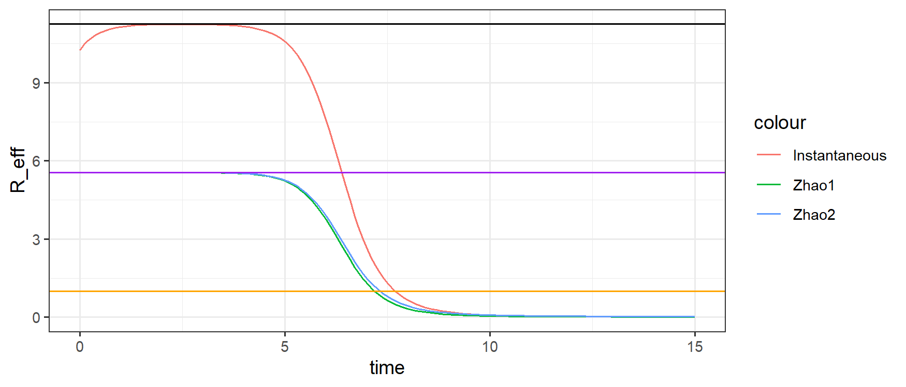
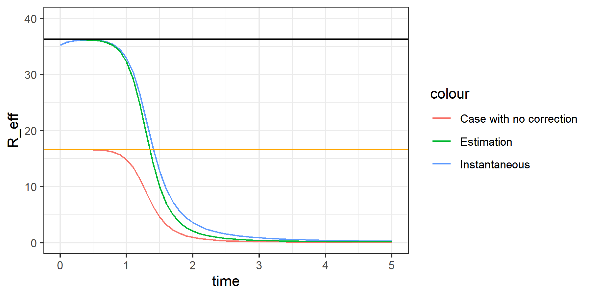

## 1. Instantaneous $\mathcal{R}_{i}$ in homogeneous model
For homogeneous SIR model:
$$\begin{cases}
    \dot{S}(t)=-\beta S(t)I(t)
    \\
    \dot{I}(t)=+\beta S(t) I(t)-\gamma I(t)
    \\
    \dot{R}(t)=+\gamma I(t)
\end{cases}$$
One can define the effective reproductive number $\mathcal{R}_{i}(t)$ as the (expected/average) instantaneous incidence caused by any randomly chosen infected individual in $I(t)$ at the moment $t$ before they recover.

Consider the expected recovery time from the exponential distribution is given by $\frac{1}{\gamma}$, this gives us:
$$\mathcal{R}_{i}=-\frac{\dot{S}(t)}{I(t)} \times\frac{1}{\gamma}=\frac{\beta}{\gamma}S(t)$$
for homogeneous model.
If we take the general definition without specifying the incidence term $\dot{S}(t)$: 
$$\mathcal{R}_{i}=-\frac{\dot{S}(t)}{I(t)} \times\frac{1}{\gamma}$$it still make sense for the definition.
This definition also indicates that the instantaneous incidence $\dot{S}(t)$ is proportional to $I(t)$

Moreover,
$$\mathcal{R}_{i}=-\frac{\dot{S(t)}}{I(t)} \times\frac{1}{\gamma}=1 \Leftrightarrow \dot{I}(t)=0$$
which fits the intuitive understanding for the effective reproductive number.

### 1.1 Migration to MSV network model
Now consider the network framework developed by [J.C. Miller, A.C. Slim & E.M. Volz(2011)](./refs/MillerSlimVolz2011.pdf) (referred as **MSV**), such that the system is now a combination of compartment of nodes:
$$\begin{cases}
    S(t)=G_p(\phi(t))
    \\
    I(t)=1-S(t)-R(t)
    \\
    \dot{R}(t)=\gamma I(t)
\end{cases}$$
and ODE for edges:
$$\dot{\phi}=-\beta\phi_I=-\beta(\phi-\phi_S-\phi_R)=-\beta\phi+\beta\frac{G_p'(\phi)}{\delta}+\gamma(1-\phi)$$
The equation for $I(t)$ still leads to:
$$\dot{I}(t)=-\dot{S}(t)-\gamma I(t)$$
like the homogeneous model. 
So it seems that we could try to migrate the $\mathcal{R}_{i}$ directly here.

### 1.2 Difference in Simulation
However, here is the simulation result for an outbreak with $\beta=0.25$, $\gamma=0.2$ on a network with Poisson degree distribution and mean degree $\delta=10$:

- The top red curve is the instantaneous $\mathcal{R}_{i}$ as defined in section 1.
- The bottom green curve is $\mathcal{R}^*_{\text{eff}}$ corresponding to Zhao1 result 
- The bottom blue curve is $\mathcal{R}^*_{c}$ corresponding to Zhao2 result.
- The top black horizontal line is estimated $max(\mathcal{R}_{i})$ as described in Section 3.
- The middle purple horizontal line is the $\mathcal{R}_{0,c}$ value given by MSV and other literatures for network.
- The bottom orange horizontal line is just reference of 1.

It is clear that instantaneous $\mathcal{R}_{i}$ defined by
- (Average/expected) number of incidence caused by **a randomly chosen** infected individual in $I(t)$ at the moment $t$ before they recover.
does not converge to $\mathcal{R}_{0,c}$ and the $\mathcal{R}^*_{c}$, which is defined by
- Average/expected number of incidence caused by a random individual **newly** infected focal vertex at time $t$ **during the whole outbreak**, **assuming every susceptible neighbor is only infected by the focal vertex**.

If we try to estimate the peak value (represent by the black in the simulation figure), it is possible for it exceed the maximum degree of the network in some special degree distribution with some feasible value of disease parameters.
- e.g. $\beta=0.25$, $\gamma=0.1$, with a network with all vertices has degree $\delta=10$, this peak value for $\mathcal{R}_{i}$ is $22.5 > 10$ as the maximum number of neighbors that any vetices have.  

So we are interested in why and how for such difference exist. 

### 1.3 Some thoughts for reason of the difference
For homogeneous model, any individual in  have same infectivity to infect susceptible nodes, because of the fully-mixed mass-action assumption for contact. 
In such case, every infected individual has the same infectivity like any individual in $I(t)$, so the $\mathcal{R}_\text{eff}$ is proportion to instantaneous incident $\dot{S}(t)$ averaged on $I(t)$, i.e. the incident is governed by $\mathcal{R}_\text{eff} \times I(t)$.

This definition might be less justifiable on MSV network frame with heterogeneity in contact. 

Consider transmission on MSV type configuration network, it is possible to have an vertex in the $I(t)$ compartment while no longer being able to transmit infection to any of its neighbor at the moment $t$, i.e. all of its neighbor are not susceptible at and after time $t$.
An obvious example would be infected vertex with degree one, whose only neighbor will be its infector and thus not being able to transmit the infection to any other vertices.

Unlike homogeneous case, such vertices are counted in $I(t)$ but contribute nothing to new infections, while also flow to $R$ compartment with same rate as those infected vertices with transmission potentials.
Similar arguments about contact heterogeneity applies to other vertices in $I$, where their heterogeneity in degree affect the their infection potential, but cannot be represented by just the proportion $I(t)$, as it is easily to see that degree distribution of infected nodes is clearly with time.

In heterogeneous network model, the instantaneous $\mathcal{R}_{i}$ as defined for homogenous model now have difference with retrospective definition, which are counting the average/expected number of all new cases caused by a random individual **newly** infected at time $t$ **during the whole outbreak**.

In earlier paper of [Volz(2008)](https://doi.org/10.1007/s00285-007-0116-4), Volz state that in their network model, the number of new infections/incidence in a small time interval is proportional to the proportion of $S-I$ pairs at the moment (which is equivalent to number of potentially newly infected vertex) in the network. 
This is in contrast to (homogeneous) compartment models in which the number of new infections/incidence is proportional the current number of infectious.

## 2. Attempt to Derive $\mathcal{R}_{i}$ from stochastic process
Consider the Bayesian Formula and a randomly chose edge/stub $u$:
$$\begin{align}
\mathbb{P}(u\in\phi \Leftrightarrow u \in\phi_I|u \text{ connect to a vertex }\in I) & = \frac{\mathbb{P}(u\in\phi_I|u\in\phi)\mathbb{P}(u\in\phi)}{\mathbb{P}(u \text{ connect to a vertex }\in I)}
\\
& =\frac{\frac{\phi_I}{\phi}\times \phi}{\frac{NI\times \mathbb{E}(K_I)}{N\delta}}
\\
& =\frac{\phi_I \delta}{I(t) \mathbb{E}[K_I]}
\end{align}$$

Following idea for **newly** infected vertex, we could slightly modify this probability argument by replacing $K_I$ with $K_I-1$ as we are sure for each infected (other than the initial patient-zero) vertex, there is one and only one edge comes from its infector, thus can no longer transmit the infection.

Unlike $K^*_I$ defined in $\mathcal{R}^*_c$ result, now $K_I$ is for random variable for all infected vertices, not newly infected vertex.
But it seems okay now, as it will be cancelled later.

We name this new probability $\eta=\frac{\phi_I \delta}{I(t) \mathbb{E}[K_I-1]}$ which is the probability that a randomly chosen edge $u$ is not yet transmit the infection, given it is connected to an infected focal vertex and not the edge infected the focal node.
Following the previous binomial distribution process, we might be able to construct the expected number of new infection caused by a **RANDOM** infected vertex instead of a **NEWLY** infected vertex.

For a random edge $u$ connected infected focal vertex at time $t$ while not connected to its infector, the probability $u$ can transmit the infection is 
$$\eta \times \phi_S \times \alpha$$
- $\eta$ as defined earlier is probability $u$ still not yet transmit disease. 
- $\eta\times\phi_S$ is the probability that such $u$ is connected to a susceptible node. Note we no longer need to conditional on $\phi$ like in $\mu$ as it is already considered in $\eta$.
- $\alpha$ is the probability such edge could transmit the infection before the infected focal vertex recovering.

Then following the binomial distribution, the expected number of new cases that a randomly infected vertex will causes at time $t$ is given by:
$$\mathcal{R}_\text{random}=\alpha \phi_S\eta (\mathbb{E}[K_I]-1)=\alpha \phi_S \frac{\phi_I \delta}{I(t) \mathbb{E}[K_I-1]} (\mathbb{E}[K_I]-1)=\alpha \times \frac{\delta \phi_S \phi_I}{I(t)}$$
Now we observe the traditional expression for $\mathcal{R}_{i}$:
$$\mathcal{R}_{i}=-\frac{\frac{dS(t)}{dt}}{I(t)}\times\frac{1}{\gamma}=-\frac{-\beta \delta\phi_S\phi_I}{I(t)}\times\frac{1}{\gamma}=\frac{\beta}{\gamma}\times \frac{\delta \phi_S \phi_I}{I(t)}$$

So they merge if $\alpha=\frac{\beta}{\gamma}$! 

But my problem is for a newly chosen $S-I$ edge in the whole network, the probability it transmit the infection before $I$ recovered or $S$ is infected by others is $\frac{\beta}{\beta+\gamma}$.
There is some inconsistency here and we need to better understand $\alpha$.

By def, $\alpha$ should be a probability while $\frac{\beta}{\gamma}$ could be larger than 1 while still feasible.

## 3. Estimation of Peak Value of $\mathcal{R}_{i}$ (i.e. $\mathcal{R}_{i,0}$)
At the peak point, we must have $\dot{\mathcal{R}}_{i}=0$, which leads to
$$0=\dot{\mathcal{R}}_{i}=-\frac{1}{\gamma}\times\frac{\ddot{S}I-\dot{S}\dot{I}}{I^2}$$
For non-zero $I(t)$, this just requires the numerator:
$$0=\ddot{S}I-\dot{S}\dot{I}=\ddot{S}I-\dot{S}(-\dot{S}-\gamma I) \Leftrightarrow I_\text{max}=-\frac{\dot{S}^2}{\ddot{S}+\gamma\dot{S}}$$
As we could represent $S$ and its derivatives with $\phi$ and PGFs but have no explicit expression for $I(t)$, we could take this relationship at peak back into $\mathcal{R}_\text{eff}$:
$$max(\mathcal{R}_{i})=-\frac{\dot{S}}{I_\text{max}}\times\frac{1}{\gamma}=-\frac{\dot{S}}{-\frac{\dot{S}^2}{\ddot{S}+\gamma\dot{S}}}\times\frac{1}{\gamma}=\frac{\ddot{S}+\gamma\dot{S}}{\gamma\dot{S}}$$
Consider the expressions we discussed in [JR_NegBinom_Result](JR_NegBinom_Result) with the following relationship for $\phi$, $\phi_S$ and $\phi_I$:
$$\dot{\phi}=\frac{d}{dt}\phi(t)=-\beta\phi_I$$
$$\phi_S=\frac{G'_p(\phi)}{\delta} \Rightarrow\dot{\phi}_S=\frac{G''_p(\phi)}{\delta}\times\dot{\phi}=-\beta\phi_I \times \frac{G''_p(\phi)}{\delta}$$
$$\dot{\phi}_I=-(\beta+\gamma)\phi_I+(-\dot{\phi}_S)=[-(\beta+\gamma)+\beta\frac{G''_p(\phi)}{\delta}] \phi_I$$
We have expression for $\dot{S}$ and $\ddot{S}$
$$\begin{align}
\dot{S}(t) & =\frac{d}{dt}S(t)=\frac{d}{dt}G_p(\phi(t))
\\
& = G'_p(\phi)\times \dot{\phi}
\\
& = \delta \times \frac{G'_p(\phi)}{\delta} \times(-\beta\phi_I)
\\
& = -\beta \delta \phi_S\phi_I
\end{align}$$
and
$$\begin{align}
\ddot{S}(t) & =\frac{d}{dt}\dot{S}(t)=\frac{d}{dt}(-\beta\delta\phi_S(t)\phi_I(t))
\\
& = -\beta\delta(\dot{\phi}_S\phi_I+\dot{\phi}_I\phi_S)
\\
& = -\beta\delta\times\{-\beta\phi_I \times \frac{G''_p(\phi)}{\delta}\times\phi_I+[-(\beta+\gamma)+\beta\frac{G''_p(\phi)}{\delta}]\phi_I\phi_S\}
\\
& = -\beta\delta\phi_S\phi_I \times [-\beta\frac{G''_p(\phi)}{\delta}\times\frac{\phi_I}{\phi_S}-(\beta+\gamma)+\beta\frac{G''_p(\phi)}{\delta}]
\\
& = \dot{S} \times[\beta\frac{G''_p(\phi)}{\delta}(1-\frac{\phi_I}{\phi_S})-(\beta+\gamma)]
\end{align}$$

Take into the previous relationships for $\dot{S}$ and $\ddot{S}$ we have:
$$\begin{align}
max(\mathcal{R}_{i}) & =\frac{\ddot{S}+\gamma\dot{S}}{\gamma\dot{S}}
\\
&=\frac{\ddot{S}}{\gamma\dot{S}}+1
\\
&=\frac{1}{\gamma}\times[\beta\frac{G''_p(\phi)}{\delta}(1-\frac{\phi_I}{\phi_S})-(\beta+\gamma)]+1
\\
&=\frac{\beta+\gamma}{\gamma}\times[\frac{\beta}{\beta+\gamma}\frac{G''_p(\phi)}{\delta}(1-\frac{\phi_I}{\phi_S})-1]+1
\\
&=\frac{\beta}{\gamma}[\frac{G''_p(\phi)}{\delta}(1-\frac{\phi_I}{\phi_S})-1]
\\
&=\frac{\beta}{\gamma}[\frac{G''_p(\phi)}{\delta}(1-\frac{\phi-\frac{\gamma}{\beta}(1-\phi)-\frac{G'_p(\phi)}{\delta}}{\frac{G'_p(\phi)}{\delta}})-1]
\\
&=\frac{\beta}{\gamma}[\frac{G''_p(\phi)}{\delta}(2-\delta\times\frac{\beta\phi-\gamma(1-\phi)}{\beta G'_p(\phi)})-1]
\end{align}$$
If we consider evaluate $max(\mathcal{R}_i(t))$ at the eigenstate as $t\rightarrow0 \Rightarrow \phi(t)\rightarrow 1, \phi_S \rightarrow 1, \phi_I \rightarrow 0$, we believe this function equals to: 
$$\mathcal{R}_{i,0}=max(\mathcal{R}_i)|_{t\rightarrow0}=\frac{\ddot{S}+\gamma\dot{S}}{\gamma\dot{S}}|_{t\rightarrow0}=\frac{\beta}{\gamma}[\frac{G''_p(1)}{\delta}(2-\delta\times\frac{\beta-\gamma(1-1)}{\beta G'_p(1)})-1]=\frac{\beta}{\gamma}[\frac{G''_p(1)}{\delta}-1]$$
This amount equals to 1 iff $\mathcal{R}_{0,c}=\frac{\beta}{\beta+\gamma}\frac{G''_p(1)}{\delta}=1$.

For Jonathan's notation in [Rnotes.pdf](./outputs/Rnotes.pdf), $\omega=\frac{G''_p(1)}{\delta}+1$ and $\rho=\frac{\beta}{\gamma}$ gives us
$$\mathcal{R}_{i,0}=\rho(\omega-2)$$
A direct observation from this derivation gives us the extra $-1$ comes from the $-(\beta+\gamma)\phi_I$ term in $\dot{\phi}_I(t)$.

(To DO) But I have not figure out why it converge to our observation at some $t>0+\epsilon$. A guess would be the initial condition need some time to reach eigenvector direction?

#### 3.1 DE of $\mathcal{R}_i$
A more straight forward or maybe more useful derivation gives an differential equation of $\mathcal{R}_i(t)$, gives the same peak value result and does not involve $I(t)$:
$$\begin{align}
\frac{d}{dt}\mathcal{R}_i(t)=\dot{\mathcal{R}}_i(t)&=\frac{d}{dt}(\frac{-\dot{S}(t)}{\gamma I(t)})
\\
& =-\frac{1}{\gamma}\times\frac{\ddot{S}I-\dot{S}\dot{I}}{I^2}
\\
& = \frac{-\dot{S}}{\gamma I} \times \frac{\ddot{S}I-\dot{S}\dot{I}}{I\dot{S}}
\\
& =\mathcal{R}_i \times [\frac{\ddot{S}}{\dot{S}}-\frac{\dot{I}}{I}]
\\
& = \mathcal{R}_i \times [\frac{\ddot{S}}{\dot{S}}-\frac{-\dot{S}-\gamma I}{I}]
\\
& = \mathcal{R}_i \times \gamma [\frac{\ddot{S}}{\gamma\dot{S}}-\frac{-\dot{S}-\gamma I}{\gamma I}]
\\
& = \gamma \mathcal{R}_i \times [\frac{\ddot{S}}{\gamma\dot{S}}+1-\frac{-\dot{S}}{\gamma I}]
\\
& = \gamma \mathcal{R}_i \times [\frac{\ddot{S}}{\gamma\dot{S}}+1-\mathcal{R}_i]
\end{align}$$
This agree with the previous derivation of $max(\mathcal{R}_i)$: when $\dot{\mathcal{R}}_i(t)=0$, we must have
$$
max(\mathcal{R}_i) =\frac{\ddot{S}}{\gamma\dot{S}}+1=\frac{\ddot{S}+\gamma \dot{S}}{\gamma\dot{S}}
$$
where does not rely on expression of $I(t)$.

Take $\ddot{S}$ and $\dot{S}$ expression into previous differential equation, we have 
$$\begin{align}
\frac{d}{dt}\mathcal{R}_i(t)=\dot{\mathcal{R}}_i(t) & =\gamma \mathcal{R}_i \times \Bigl[\frac{\ddot{S}}{\gamma\dot{S}}+1-\mathcal{R}_i \Bigr]
\\
& =\gamma \mathcal{R}_i \times \Bigl\{\frac{\beta}{\gamma}\Bigl[\frac{G''_p(\phi)}{\delta}(1-\frac{\phi_I}{\phi_S})-1 \Bigr]-\mathcal{R}_i\}
\\
& = \gamma\mathcal{R}_i \times \Big\{\frac{\beta+\gamma}{\gamma}\Big[\frac{\beta}{\beta+\gamma}\frac{G''_p(\phi)}{\delta}(1-\frac{\phi_I}{\phi_S})\Big]-\frac{\beta}{\gamma}-\mathcal{R}_i\Big\}
\\
& = \mathcal{R}_i \times \Big\{(\beta+\gamma)\Big[ \mathcal{R}^*_c (1-\frac{\phi_I}{\phi_S}) \Big]-\beta-\gamma\mathcal{R}_i \Big\}
\end{align}$$
Note we have 
$$\mathcal{R}^*_c=\frac{\beta}{\beta+\gamma}\frac{G''_p(\phi)}{\delta}=\frac{\beta}{\beta+\gamma}\frac{\phi_s}{\phi} \times \mathbb{E}\Big[ K^*_I-1\Big]$$ where $\frac{\phi_s}{\phi} \times \mathbb{E}\Big[ K^*_I-1\Big]$ could be interpreted as average number of susceptible neighbours of newly infected focal vertex.
So $$\mathcal{R}^*_c \times \frac{\phi_I}{\phi_S}\propto \frac{\phi_I}{\phi}\times\mathbb{E}\Big[ K^*_I-1\Big]$$
which is the average infected neighbors (except its infector represented by the $-1$) of the newly infected focal node. ??Related to the existing infection in the past.

Similar $S-I$ structure could also been seen in the following homogeneous version.

**TODO: Verify the R_i ODE in simulation**
#### Homogeneous SIR
Note this derivation also applies to homogeneous SIR model.
$$\begin{align}
\frac{d}{dt}\mathcal{R}_i(t)=\dot{\mathcal{R}}_i(t) & =\gamma \mathcal{R}_i \times [\frac{\ddot{S}}{\gamma\dot{S}}+1-\mathcal{R}_i]
\\
& = \gamma \mathcal{R}_i \times [\frac{-\beta(\dot{S}I+\dot{I}S)}{\gamma\dot{S}}+1-\mathcal{R}_i]
\\
& = \gamma \mathcal{R}_i\times[-\frac{\beta}{\gamma}(I+\frac{(-\dot{S}-\gamma I)S}{\dot{S}})+1-\mathcal{R}_i]
\\
& = \gamma \mathcal{R}_i\times[-\frac{\beta}{\gamma}(I-S+\frac{(-\gamma I)S}{-\beta S I})+1-\mathcal{R}_i]
\\
& = \gamma \mathcal{R}_i\times[-\frac{\beta}{\gamma}(I-S+\frac{\gamma}{\beta})+1-\mathcal{R}_i]
\\
& =\gamma \mathcal{R}_i\times[\frac{\beta}{\gamma}(S-I)-\mathcal{R}_i]
\\
& =\gamma \mathcal{R}_i\times[\mathcal{R}_c-\frac{\beta}{\gamma}I-\mathcal{R}_i]
\\
& =-\beta \mathcal{R}_i\times I
\end{align}$$

Note for homogeneous SIR, we have $$\mathcal{R}_c=\mathcal{R}_i=-\frac{1}{\gamma}\times\frac{\dot{S}}{I}=\frac{\beta}{\gamma}S$$

### 3.2 Poisson
For Poisson distribution with:
$$G_p(\phi)=e^{-\delta(1-\phi)}$$
$$G'_p(\phi)=\delta e^{-\delta(1-\phi)}$$
$$G''_p(\phi)=\delta^2 e^{-\delta(1-\phi)}$$we have
$$\begin{align}
max(\mathcal{R}_{i}) & =\frac{\beta}{\gamma}[\frac{G''_p(\phi)}{\delta}(2-\delta\times\frac{\beta\phi-\gamma(1-\phi)}{\beta G'_p(\phi)})-1]
\\
& =\frac{\beta}{\gamma}[\delta e^{-\delta(1-\phi)}(2-\frac{\beta\phi-\gamma(1-\phi)}{\beta e^{-\delta(1-\phi)}})-1]
\\
& = \frac{\beta}{\gamma}[2\delta e^{-\delta(1-\phi)}-\delta\phi+\frac{\gamma}{\beta}(1-\phi)\delta-1] 
\end{align}$$

If we consider $\phi \rightarrow 1$ we have $max(\mathcal{R}_{i})$ converge to our observation:
$$\lim_{\phi\rightarrow1}{max(\mathcal{R}_{i})}=\frac{\beta}{\gamma}(2\delta -\delta-1)=\frac{\beta}{\gamma}(\delta-1)$$

### 3.3 Negative Binomial
For general NB distribution with:
$$S=G_p(\phi)=(\frac{1}{1+\kappa\delta-\phi\times\kappa\delta})^{\frac{1}{\kappa}}$$
$$G'_p(\phi)=(\frac{1}{1+\kappa\delta-\phi\times\kappa\delta})^{\frac{1}{\kappa}}\times\frac{\delta}{1+\kappa\delta-\phi\times\kappa\delta}=\frac{S\delta}{1+\kappa\delta-\phi\times\kappa\delta}=\delta S^{\kappa+1}$$
$$G''_p(\phi)=\delta^2(\kappa+1)S^{2\kappa+1}$$we have
$$\begin{align}
max(\mathcal{R}_{i}) & =\frac{\beta}{\gamma}[\frac{G''_p(\phi)}{\delta}(2-\delta\times\frac{\beta\phi-\gamma(1-\phi)}{\beta G'_p(\phi)})-1]
\\
& =\frac{\beta}{\gamma}[\delta (\kappa+1)S^{2\kappa+1}(2-\frac{\beta\phi-\gamma(1-\phi)}{\beta S^{\kappa+1}})-1]
\\
& =\frac{\beta}{\gamma}[\delta (\kappa+1)(2S^{2\kappa+1}-S^{\kappa}(\phi-\frac{\gamma}{\beta}(1-\phi)))-1]
\end{align}$$

If we consider $\phi \rightarrow 1 \Leftrightarrow S \rightarrow 1$ we have $max(\mathcal{R}_{i})$ converge to:
$$\lim_{\phi\rightarrow1}{max(\mathcal{R}_{i})}=\frac{\beta}{\gamma}(\delta(\kappa+1)-1)$$

### 3.3 Test Ideas between $\mathcal{R}_i$ and $\mathcal{R}_c$
For the $\mathcal{R}^*_c$, we derive the "phenomenological heterogeneity" term $\sigma^*_c$.
We wonder how this connect to the true phenomenological heterogeneity term
$$\sigma_i=\frac{\mathcal{R}_{i}}{\mathcal{R}_{0,i}\times S}=\frac{\mathcal{R}_{i}}{max(\mathcal{R}_{i})\times S}$$

However it seems $\sigma^*_c S \times max(\mathcal{R}_{i})$ does not match $\mathcal{R}_{i}$: See [NetworkExamples.R](NetworkExamples.R)

Current idea is to figure out the true $R_c$ first without the problematic assumption to see if we can figure out the $\sigma_c$, then see how it connects to $\sigma_i$.
A separate note is created: [NoteForR_c.md](NoteForR_c.md)

### Problem: 
Unlike the $\mathcal{R}_{0,c}$ or $\mathcal{R}^*_{c}$ , $max(\mathcal{R}_{i})|_{\phi=1}$ this amount could easily be larger than the maximum degree as there is no bond for the ratio $\frac{\beta}{\gamma}$. 
- E.g. consider a network with every nodes has degree $k=5$, then $\delta=5$ and $G''_p(1)=k^2-k=20$, assume $\beta=0.2$ and $\gamma=0.1$, then
$$max(\mathcal{R}_\text{eff})|_{\phi=1}=\frac{\beta}{\gamma}[\frac{G''_p(1)}{\delta}-1]==\frac{0.2}{0.1}[\frac{20}{5}-1]=6>k=5$$
- We need a better definition for this!

