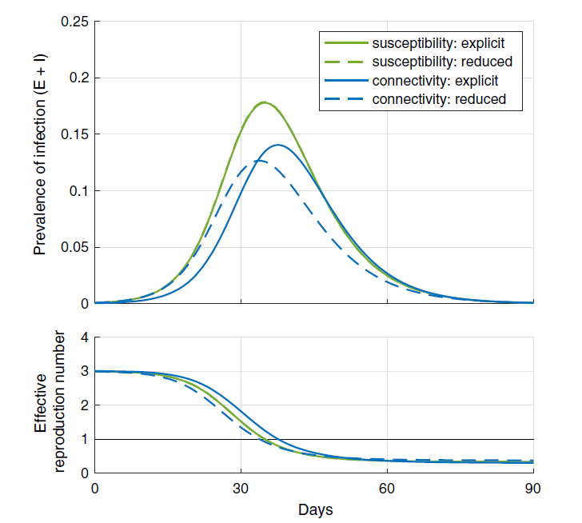
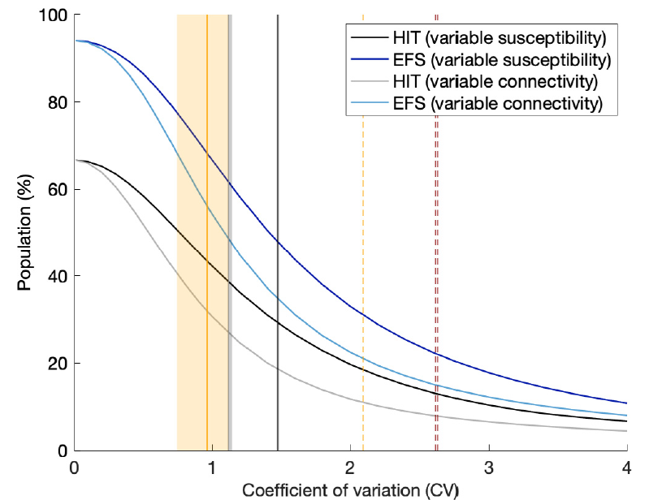
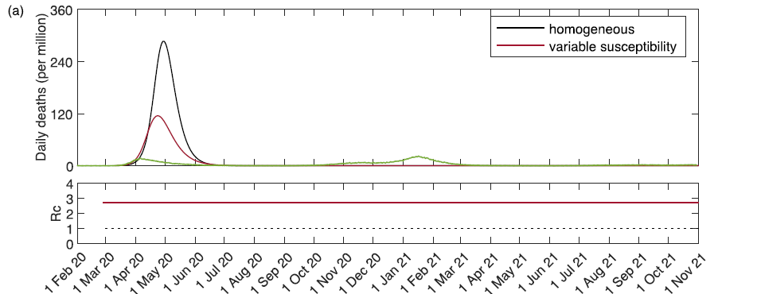
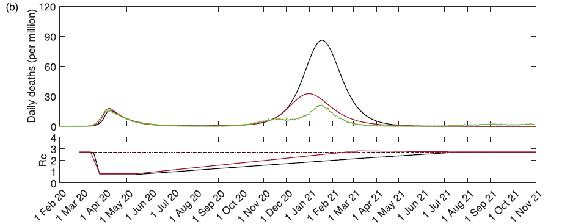
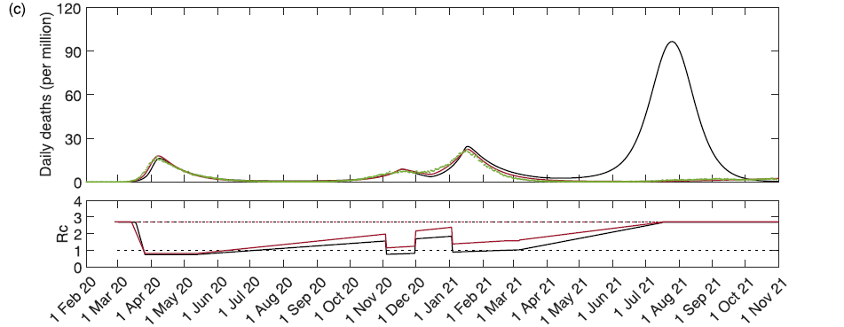
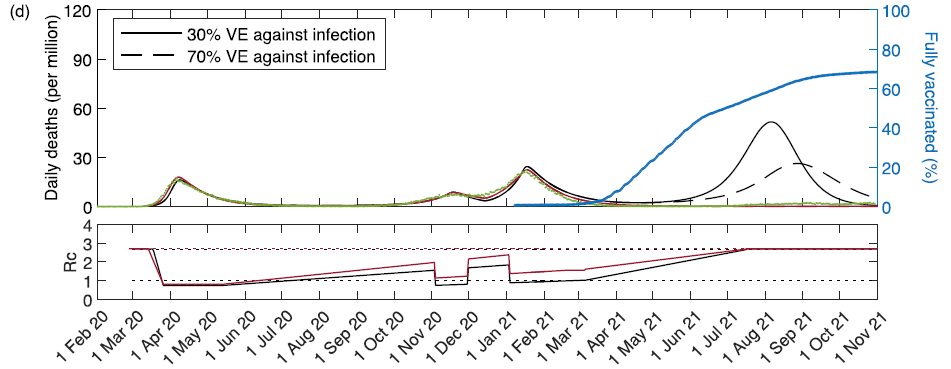
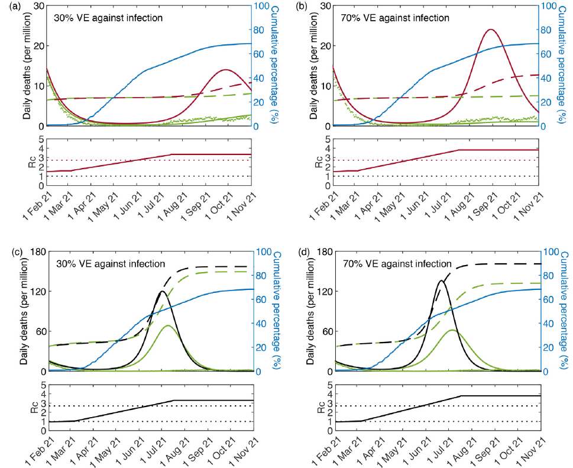

## Related papers

- [MGM. Gomes,EtAl.(2022)](https://doi.org/10.1016/j.jtbi.2022.111063) 
- [A. Montalban, RM. Corder and MGM. Gomes(2022)](https://doi.org/10.1007/s00285-022-01771-x)
- [Novozhilov(2008)](./refs/Novozhilov2008.pdf)

## Heterogeneous/Variable Susceptibility Model

More model details in [A. Montalban, RM. Corder and MGM. Gomes(2022)](https://doi.org/10.1007/s00285-022-01771-x).

Assuming
1.  random mixing
2. heterogeneous susceptibility with continuous trait $x$ where the susceptibility of an individual at level $x$ is proportional to $x$
	- In other words, if we compare an individual at level $x$ and an individual at level $y$, the one at level $x$ is $x/y$ times more likely to get infected than the one with susceptibility $y$.

- $x$ is the individual susceptibility to infection in relation to the mean
- $q(x)$ is the continuous distribution with mean $\int x q(x) dx=1$.
- $q(x)$ is parameterized by coefficient of variation(CV) $v=\sqrt{\int (x-1)^2 q(x) dx}$ =stdv of $x$.
- $\lambda$ is the average force of infection, such that $$\lambda=\frac{\beta}{N}\int (\rho E(x,t)+I(x,t))dx=\frac{\beta}{N}(\rho E(t)+I(t))$$
- $\rho$ is the infectiousness ratio factor of $E$ comparing to $I$
- $\delta$ is the processing rate from $E$ to $I$
- $\phi$ is the proportion of death due to COVID/the disease

They created an SEIR model such that for each "trait" $x$, an equivalent PDE system is given by
$$
\begin{align}
\frac{\partial S(x,t)}{\partial t} & = -\lambda x S(x,t)
\\
\frac{\partial E(x,t)}{\partial t} & = +\lambda x S(x,t)-\delta E(x,t)
\\
\frac{\partial I(x,t)}{\partial t} & = +\delta E(x,t)-\gamma I(x,t)
\\
\frac{\partial R(x,t)}{\partial t} & = +(1-\phi)\gamma I(x,t) 
\end{align}
$$
==In infection term, both connectivity and infectiousness is homogeneous. And all other dynamic quantities are also homogeneous.==

While the basic reproductive number is given by $$\mathcal{R}_0=\beta(\frac{\rho}{\delta}+\frac{1}{\gamma})$$
Additionally, they defined $\mathcal{R}_c$ to reflect impact of time varying factors (e.g. NPIs, behavior changes, seasonality and pathogen evolution) to reproductive number, such that$$\mathcal{R}_c=c(t)\times\mathcal{R}_0$$
- $c(t) > 0$ describes the risk of infection at time $t$ in relation to baseline, reflecting the impact of control/intervention to infection/transmission event.

They follow [Novozhilov(2008)](./refs/Novozhilov2008.pdf) and derive the SEIR version of Novozhilov, also assuming that $q(x)$ is Gamma distribution. Then the ODE system for 
$$
\begin{align}
\frac{d S}{dt} & = -\beta (\rho E+I)(\frac{S}{N})^{1+v^2}
\\
\frac{d E}{dt} & = +\beta (\rho E+I)(\frac{S}{N})^{1+v^2}-\delta E
\\
\frac{d I}{dt} & = +\delta E -\gamma I
\\
\frac{d R}{dt} & = +(1-\phi)\gamma I 
\end{align}
$$
This is equivalent of [Novozhilov(2008)](./refs/Novozhilov2008.pdf) result as $p=1+v^2$ for $S^p$.
- They take $S(0)=S_0=1$
### Effective Reproduction Number, Herd Immunity Threshold(HIT) and Epidemic Final Size(EFS) 
The effective reproduction number $\mathcal{R}_{\text{eff}}(t)$ is a time-dependent quantity loosely defined as the number of secondary infections generated by a typical infected individual when the susceptibility of the population is $S(t)$ at time t.

As a derivation of their variable susceptibility model: $$\mathcal{R}_{\text{eff}}(t)=\mathcal{R}_c(\frac{S(t)}{N})^{1+v^2}=c(t)\mathcal{R}_0(\frac{S(t)}{N})^{1+v^2}$$
The population is said to be at or above the ==**Herd Immunity Threshold(HIT)**== for a pathogen if its susceptibility profile ($S$) to that pathogen is such that a new introduction of infection (i.e., a small increase in E or I) does not trigger an outbreak. 
In this model, HIT is reached if where $$\mathcal{R}_{\text{eff}} \leq 1$$
If only consider natural infection (i.e. no intervention) such that $c(t) \equiv 1$, then the HIT is given by $$\mathcal{H}= 1-(\frac{1}{\mathcal{R}_0})^{\frac{1}{1+v^2}}$$
- If $S(t) \leq \mathcal{H}$ new epidemic outbreak will not happen naturally if pathogen is re-introduce to the population.
- For homogeneous model, $$\mathcal{H}= 1-(\frac{1}{\mathcal{R}_0})$$
The final infected size $R(\infty)$ is given implicitly by $$(1-R(\infty))^{v^2}(v^2 \mathcal{R}_0 R(\infty)+1)=1$$

## Heterogeneous/Variable Connectivity Model

For this model, they also name it as "variation in exposure to infection" in [MGM. Gomes,EtAl.(2022)](https://doi.org/10.1016/j.jtbi.2022.111063).

They are ==not using any network/graph approach== to modeling heterogenous connectivity, just simply assume
1. random mixing 
2. heterogeneous connectivity with same continuous trait $x$
	- i.e. an individual at level $x$ to acquire infection and transmit to others are both proportional to $x$.
This is beyond the [Novozhilov(2008)](./refs/Novozhilov2008.pdf) framework, which assume infectee inherit infectivity trait from infector. But it is indeed closer to network idea.

Comparing the PDE system of Heterogeneous/Variable susceptibility model, the changes is the average force of infection: $$\lambda=\frac{\beta}{N}\frac{\int x(\rho E(x,t)+I(x,t))dx}{\int x q(x)dx}=\frac{\beta}{N}\int x(\rho E(x,t)+I(x,t))dx$$
The traits are now inherited to $E,I,R$ class but not affect the parameters. They introduce new notation for the first/second moments of $S(x,t), E(x,t), I(x,t), R(x,t)$ such that $$\begin{align}
\bar{S}(t) & = \int xS(x,t)dx \text{~and~} \bar{\bar{S}}(t) = \int x^2S(x,t)dx
\\
\bar{E}(t) & = \int xE(x,t)dx
\\
\bar{I}(t) & = \int xI(x,t)dx
\\
\bar{R}(t) & = \int xR(x,t)dx 
\end{align}$$
Assume Gamma distribution for $q(x)$ again, they derive that $$\begin{align}
\bar{S}(t) & =\int x S(x,t)dx=S(t)^{1+v^2}
\\
\bar{\bar{S}}(t) & =\int x^2 S(x,t)dx=S(t)^{1+2v^2}
\end{align}$$
With the ODE system based on moments:
$$\begin{align}
\frac{d \bar{S}}{dt} & = -\beta (\rho \bar{E}+\bar{I})(\frac{\bar{\bar{S}}}{N})=-(1+v^2)\beta (\rho \bar{E}+\bar{I})(\frac{\bar{S}}{N})^\frac{1+2v^2}{1+v^2}
\\
\frac{d \bar{E}}{dt} & = +\beta (\rho \bar{E}+\bar{I})(\frac{\bar{\bar{S}}}{N})-\delta \bar{E}=+(1+v^2)\beta (\rho \bar{E}+\bar{I})(\frac{\bar{S}}{N})^\frac{1+2v^2}{1+v^2}-\delta \bar{E}
\\
\frac{d \bar{I}}{dt} & = +\delta \bar{E} -\gamma \bar{I}
\\
\frac{d \bar{R}}{dt} & = +(1-\phi)\gamma \bar{I}
\end{align}$$
They claim that if the duration of individual infectious time(include exposure and infected) is relatively small compare to the duration of the outbreak, then the following approximation stand:$$\bar{\bar{S}}/\bar{S}\approx\bar{I}/I$$
For a SIR version of the system in [A. Montalban, RM. Corder and MGM. Gomes(2022)](https://doi.org/10.1007/s00285-022-01771-x).
Without explicit derivation or statement, they seems modify this to SEIR and assume:$$\frac{\bar{\bar{S}}}{\bar{S}}\approx\frac{\rho \bar{E}+\bar{I}}{\rho E + I}$$
This allows them to deduce typical SEIR-like ODE system from the previous moment ODE system:
$$\begin{align}
\frac{d S}{dt} & = -(1+v^2)\beta (\rho \bar{E}+\bar{I})(\frac{S}{N})^{1+2v^2}
\\
\frac{d E}{dt} & = +(1+v^2)\beta (\rho \bar{E}+\bar{I})(\frac{S}{N})^{1+2v^2}-\delta E
\\
\frac{d I}{dt} & = +\delta E -\gamma I
\\
\frac{d R}{dt} & = +(1-\phi)\gamma I
\end{align}$$

This is not necessary a good approximation: Fig.4 in [A. Montalban, RM. Corder and MGM. Gomes(2022)](https://doi.org/10.1007/s00285-022-01771-x) present a numerical comparison between the deduced system with the original moment system:

- Solid curves were generated by running a discretized version of the infinite system
	- Explicit gamma distributed susceptibility (green) 
	- Explicit gamma distributed Connectivity (blue).
- Dashes curves are the corresponding outputs of the reduced systems 
- Parameters: $\mathcal{R}_0=3$; $\delta = 1/4$ per day; $\gamma = 1/3$ per day and $v = 1$

In [MGM. Gomes,EtAl.(2022)](https://doi.org/10.1016/j.jtbi.2022.111063) they mostly just proposed this model and the numerical result and discussion are rarely related to this model.
### Effective Reproduction Number, Herd Immunity Threshold(HIT) and Epidemic Final Size(EFS) 
==**Without the approximation**==, they can still derive the effective Reproduction Number:$$\mathcal{R}_{\text{eff}}(t)=c(t)\mathcal{R}_0(t)(\frac{S(t)}{N})^{1+2v^2}$$
Therefore, the HIT of this variable connectivity model: $$\mathcal{H}=1-\mathcal{R}_0^{-\frac{1}{1+2v^2}}$$
Furthermore, the EFS:$$R(\infty)=(1-R(\infty))^{v^2}(2v^2 \mathcal{R}_0 R(\infty)+1)=1$$

## Impact of Heterogeneity to HIT $\mathcal{H}$ and EFS $R(\infty)$
Fig. 14 of [MGM. Gomes,EtAl.(2022)](https://doi.org/10.1016/j.jtbi.2022.111063)

As coefficient of variation $v$ increase, the HIT $\mathcal{H}$ and EFS $R(\infty)$ both decrease. 
The homogeneous model will have same HIT as $v=0$.
Vertical lines are fitted $v$ values of different outbreaks based on literatures or their fitting results.
- Black: susceptibility to SARS-CoV-2 in England and Scotland
- Grey: connectivity to SARS-CoV-2 in England and Scotland

==Since the dynamic impact of heterogeneity is corresponding to selection by natural infection, therefore the HIT $\mathcal{H}$ and the expression here are **natural** herd immunity threshold.==

They emphasize that formulas for $\mathcal{H}$ of both cases refer to herd immunity by natural infection and do not apply to herd immunity induced by vaccines (unless vaccination programs were designed to mimic the selection exerted by natural infection which
is not generally the case [Fine et al., 2011](https://doi.org/10.1093/cid/cir007)). 

For a random vaccination program, the HIT induced by the vaccine would be
$$\mathcal{H}_\text{v}=\frac{1-\frac{1}{\mathcal{R}_0}}{1-\sigma_{\text{v}}}$$where $\sigma_\text{v}$ is the susceptibility of a vaccinated individual relative to unvaccinated. 
As a corollary, the HIT can only be reached by random vaccination if the vaccines in
use are more than $1-1/\mathcal{R}_0$ efficacious against infection.

They also claim that "*such naturally acquired immunity had a much larger role than what might have been expected according to models that take less account of individual variation in susceptibility and exposure to infection*".

## Model vs Data
They first fit all model parameters with COVID-19 England daily deaths data from Feb 2020 to Jul 2020, and then take the best fit parameter to compare with data from Feb 2020 to Nov 2021 as presented in Fig. 15 of [MGM. Gomes,EtAl.(2022)](https://doi.org/10.1016/j.jtbi.2022.111063)

### Fig.15(a) No Interventions $\mathcal{R}_c=const.$

- Black: homogeneous model
- Red: variable susceptibility model
- Green: data
Without intervention, the first outbreak will be tremendous such that HIT is reached and block the later outbreak.

### Fig.15(b) Only first lockdown

They claim that "*more strikingly*" the heterogeneous susceptibility model with just first lockdown "*is not far from the real data (which included lockdowns 2 and 3)*"
- (Implicitly indicating that 2nd and 3rd lockdown is not that efficient)

### Fig.15(c) All 3 lockdowns without vaccination

Both model fit with the data better.
In the absence of vaccination, a large exit wave would have been expected under the homogeneous model.
Only a shallow hump is apparent when individual variation is considered.
- (If consider the heterogeneity, impact of vaccination is less significant for preventing new outbreaks)

## Vaccination model
To explore the effects of vaccination together with heterogeneous susceptibility, they modified the existing model with vaccinated compartments, but only in trait-PDE level.

$$
\begin{align}
\frac{\partial S(x,t)}{\partial t} & = -\lambda x S(x,t)-v(t)S(x,t)
\\
\frac{\partial E(x,t)}{\partial t} & = +\lambda x S(x,t)-\delta E(x,t)-v(t)E(x,t)
\\
\frac{\partial I(x,t)}{\partial t} & = +\delta E(x,t)-\gamma I(x,t)-v(t)I(x,t)
\\
\frac{\partial R(x,t)}{\partial t} & = +(1-\phi)\gamma I(x,t)-v(t)R(x,t)
\\
\frac{\partial S_v(x,t)}{\partial t} & = +v(t)S(x,t)-(1-\xi)\lambda x S_v(x,t)
\\
\frac{\partial E_v(x,t)}{\partial t} & = +v(t)E(x,t)+(1-\xi)\lambda x S_v(x,t)-\delta E_v(x,t)
\\
\frac{\partial I_v(x,t)}{\partial t} & = +v(t)I(x,t)+\delta E_v(x,t)-\gamma I_v(x,t)
\\
\frac{\partial R_v(x,t)}{\partial t} & = +v(t)R(x,t)+(1-(1-\zeta)\phi)\gamma I_v(x,t)
\end{align}
$$
- $\xi$ is the efficacy/protection of vaccination against infection
- $\zeta$ is the parameter such that $1-(1-\xi)(1-\zeta)$ is the efficacy/protection of vaccination against death (??)
- $v(t)$ is the fully vaccinated(2 doses) proportion at the moment $t$
- The force of infection $\lambda$ is now modified to $$\lambda=\int[\rho(E(x,t)+E_v(x,t))+I(x,t)+I_v(x,t)]dx$$
They also emphasize since vaccination program might not 

Using similar fitting process with this new model, they generate Fig. 15(d) assuming two different scenario:
- Solid: $\xi=30\%$ with $1-(1-\xi)(1-\zeta)=90\%$ 
- Dashed: $\xi=70\%$ with $1-(1-\xi)(1-\zeta)=90\%$

- Due to scaling, the dashed red overlap with solid red curve for heterogeneous susceptibility case.
- Blue is the data of fully vaccinated proportion.
- Under homogeneous model (black), they claim no vaccination program can fill in the gap between projection and data.
- (Considering heterogeneous susceptibility increase the capability of model to fitting with reality)

To better illustrate the difference with vaccination, they provided enlarged figures focus on periods with vaccination in Fig. 16 of [MGM. Gomes,EtAl.(2022)](https://doi.org/10.1016/j.jtbi.2022.111063).

- Red Solid: heterogeneous susceptibility model without vaccination
- Black Solid: homogeneous model with vaccination
- Green Solid: heterogeneous susceptibility model with vaccination
- Green dots at the bottom: data
- Blue Solid: fully vaccinated proportion
- Red Dashed: cumulative proportion of infected under heterogeneous model
- Black Dashed: cumulative proportion of infected under homogeneous model

*"When mitigations are applied the discrepancy between homogeneous and heterogeneous trajectories increases as the pandemic progresses, eventually causing the rejection of models that lack sufficient heterogeneity.* 
*By then, however, such homogeneous models would have over-attributed impact to interventions, and may have induced governments to systematically make suboptimal decisions by over-weighting benefits in relation to the costs and collateral damages of control measures."*