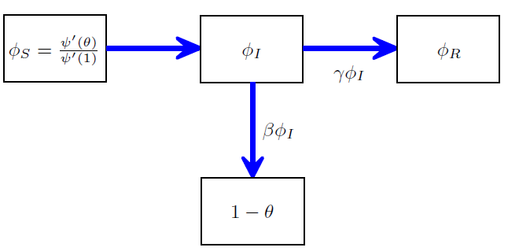

# Connection between Novozhilov with network models

-   [Novozhilov(2008)](./refs/Novozhilov2008.pdf)
-   [J.C. Miller, A.C. Slim & E.M. Volz(2011)](./refs/MillerSlimVolz2011.pdf)
-   [I.Z. Kiss, J.C. Miller & P.L. Simon(2017)](https://link.springer.com/book/10.1007/978-3-319-50806-1)

## Novozhilov's Framework for PhenHet

The Novozhilov framework provide a connection between

-  heterogeneous in susceptibility and/or infectivity with some known distributions parameterized by a single variable (trait) $\omega_s$ or $\omega_i$ and time $t$.
    - Density of susceptible/infected individuals with trait $\omega_s$ or $\omega_i$ is $s(t,\omega_s), i(t, \omega_i)$
    - pdf $p_s(t,\omega_s)=\frac{s(t,\omega_s)}{S(t)}, p_i(t,\omega_i)=\frac{i(t,\omega_s)}{I(t)}$ respectively
    - The transmission rate $\beta$ is determined by the traits $\omega_s$ and $\omega_i$ independently, such that $\beta=\beta(\omega_s,\omega_i)=\beta_s(\omega_s) \beta_i(\omega_i)$
    - For each traits of S, the density $s(t,\omega_s)$ in trait $\omega_s$ is governed by ODE:
    $$
    \begin{align}
    \frac{\partial s(t,\omega_s)}{t}&=s(t,\omega_s)\beta_s(\omega_s) \int_{\Omega_i} \beta_i(\omega_i) i(t,\omega_i) d \omega_i
    \\
    &=s(t,\omega_s)\beta_s(\omega_s)I(t) \int_{\Omega_i} \beta_i(\omega_i) p_i(t,\omega_i) d \omega_i
    \\
    &=s(t,\omega_s)\beta_s(\omega_s)I(t) \bar{\beta_i}(t)
    \end{align}
    $$
    - $\psi(\omega_i,\omega_i')$ is the probability that a newly infected individual gets trait value $\omega_i$ if infected by an individual with trait value $\omega_i'$
    - Assume perfect inheriting and fidelity of infectiousness: the infectivity traits $\omega_i$ of new infected individual must be inherited from its infector, s.t.
    $$
    \psi(\omega_i,\omega_i')=\delta(\omega_i'-\omega_i)
    $$ 
    with Dirac delta function $\delta(x)$
    -   For each traits of I, the density $i(t,\omega_s)$ in trait $\omega_s$ is governed by ODE:
    $$
    \begin{align}
    \frac{\partial i(t,\omega_i)}{t}&=\int_{\Omega_s} \int_{\Omega_i} {s(t,\omega_s) \beta_s(\omega_s) \psi(\omega_i,\omega_i') i(t,\omega_i') \beta_i(\omega_i')} d \omega_i' d \omega_s - \gamma i(t,\omega_i)
    \\
    &=\int_{\Omega_s}s(t,\omega_s)\beta_s(\omega_s) d \omega_s \times \int_{\Omega_i}\delta(\omega_i-\omega_i')i(t,\omega_i')\beta_i(\omega_i')d \omega_i'- \gamma i(t,\omega_i)
    \\
    &=S(t)\int_{\Omega_s}p_s(t,\omega_s)\beta_s(\omega_s)d \omega_s \times \beta_i(\omega_i)i(t,\omega_i)
    \\
    &=S(t) \bar{\beta_s}(t)\beta_i(\omega_i)i(t,\omega_i)- \gamma i(t,\omega_i)
    \end{align}
    $$
-   Homogeneous models with general nonlinear but separable transmission functions: 
$$
\begin{align}
\frac{d}{dt}S&=-h_s(S)\times h_i(I)
\\
\frac{d}{dt}I&=+h_s(S)\times h_i(I)+\cdots
\end{align}
$$
where $h_s$ and $h_i$ are determined purely by the moment generating function (mgf) of $p_s$ and $p_i$ at initial time $t=0$.

A subcase of the general framework, with $\omega_s$ and $\omega_i$ being gamma-distributed and $\beta_s(\omega_s)=\omega_s, \beta_i(\omega_s)=\omega_i \Leftrightarrow \beta=\omega_s\omega_i$ and leads to the known result with power incidence functions: 
$$
\beta S^p I^q
$$
at least for SI model.

- For SIR model, $\beta S^p I$ form has been generated by homogeneous infectivity.
- SI $S^p I^q$ cases are derived in the [original paper](https://link.springer.com/book/10.1007/978-3-319-50806-1). A further derivation of SIR case are presented in [I_q_and_Exponential_Incident.md](I_q_and_Exponential_Incident.md).

This frame provide a mechanism derivation to a more general class of non-linear incidence expression and provide a clear relationship from the "parametric" heterogeneity to the non-linear incidence term.

However, this framework is limited to following assumptions:

1.  the infectivity traits $\omega_i$ of new infected individual must be inherited from its infector
    -  $\psi(\omega_i,\omega_i')$ is the probability that a newly infected individual gets trait value $\omega_i$ if infected by an individual with trait value $\omega_i'$ and require $\psi(\omega_i,\omega_i')=\delta(\omega_i'-\omega_i)$

    -   This guaranteed that for each infectivity trait $\omega_i$ and time $t$, the population of the infection with such trait satisfy:
    $$
    \begin{align}
    \frac{\partial s(t,\omega_s)}{t}&=-s(t,\omega_s)\times F(S(t),I(t),\omega_i)
    \\
    \frac{\partial i(t,\omega_i)}{t}&=i(t,\omega_i)\times G(S(t),I(t),\omega_s)
    \end{align}
    $$
    So Theorem 1 in the article could be applied.
    - This is somehow justifiable if we consider the strain of pathogen or homogeneous in infectivity

2.  The heterogeneity only applies to infectivity and susceptibility while contact rate of individuals are still assumed to be homogeneous and fully-mixed.

3.  The transmission probability/rate $\beta=\beta(\omega_s,\omega_i)$ are determined by traits of infectivity and susceptibility independently s.t. $\beta=\beta(\omega_s,\omega_i)=\beta_s(\omega_s) \beta_i(\omega_i)$

## Network Models with similar settings

Some similar approach using traits and generating functions has been applied to considering heterogeneity in contact rates with networks, by R.M. Anderson, A.L. Lloyd & R.M. May([1988](https://doi.org/10.1098/rstb.1988.0108), [1991 book](https://mcmaster.primo.exlibrisgroup.com/discovery/fulldisplay?docid=alma991008325239707371&context=L&vid=01OCUL_MU:OMNI&lang=en&search_scope=OCULDiscoveryNetwork&adaptor=Local%20Search%20Engine&tab=OCULDiscoveryNetwork&query=any,contains,Infectious%20Diseases%20of%20Humans&mode=basic), [2001](https://doi.org/10.1103/PhysRevE.64.066112)) and R. Pastor-Satorras & A. Vespignani ([2001](https://doi.org/10.1103/PhysRevLett.86.3200), [2002](https://doi.org/10.1140/epjb/e20020122)) which release the assumption 2. In these approaches, the traits $\omega$ are replaced by the degree $k$ of the individual/vertex.

- These network model assume that degree is invariant with time and infection events.
- Assumption 1, thus the Novozhilov's framework, cannot be applied to network model.

The system of these model can be written into following system by degree 
$$
\begin{align}
\frac{\partial s(t,k)}{\partial t}&=-s(t,k) \times k \times \beta \times  \int_{j}\frac{ j P(j) i(t,j)} {\langle K \rangle} dj
\\
&=-s(t,k) k \beta \int_{j} P_e(j) i(t,j) dj
\\
\frac{\partial i(t,k)}{\partial t}&=+s(t,k) \times k \times \beta \times  \int_{j}\frac{ j P(j) i(t,j)} {\langle K \rangle} dj-\gamma i(t,k)
\\
&=s(t,k) k \beta \int_{j} P_e(j) i(t,j)dj-\gamma i(t,k)
\end{align}
$$

- $P(k)$ is the degree distribution of the network

- $s(t,k)$ and $i(t,k)$ are the density of susceptible/infected individual with degree $k$ at time $t$.

- $\beta$ is the transmission probability of each edge

- $\langle K \rangle=\int_{k} k P(k)$ is the expected degree

- $P_e(k)=\frac{k P(k)}{\langle K \rangle}$ is the pdf of excess degree distribution, or the degree-biased distribution
	- Also, the probability of a uniformly randomly chosen edge belongs to a vertex with degree $k$ in the network
    - Also, the probability of a randomly chosen neighbor vertex has degree $k$
    - Same idea with the size/length-biased sampling: the probability of such neighbor being chosen is proportional to its degree.

- Comparing with Novozhilov's framework without assumption 1,
    - $\beta_s(k)=k \beta$ is determined by contact rate/degree of susceptible vertex
    - $\beta_i(j)=P_e(j)$ is determined by contact rate/degree of the infected vertex

    - However, $\psi$ is now depend on trait/degree of $s(t,k)$ instead of $i(t,j)$, such that $\psi=\psi(k,k')=\delta(k-k')$

We can find a solution for equation of $s(t,k)$: $$
s(k,t)=e^{-\beta k \int_{-\infty}^{t}P_e(j)i(t',j)dt'}
$$we take $\theta(t)=e^{-\beta \int_{-\infty}^t P_e(j)i(t',j)dt'}$ then $s(k,t)=\theta(t)^k$.

[J.C. Miller, A.C. Slim & E.M. Volz(2011)](https://link.springer.com/book/10.1007/978-3-319-50806-1) has proved that with this change of notation, this model is equivalent to their percolation-based model assuming Mean-Field Social Heterogeneity (MFSH) where at each moment, every individual/vertex reform their edges uniformly randomly while keeping their assigned degree and all neighbors are interchangeable in each compartment.

Strong connection with random-network models with assumptions other than MFSH are discussed in [I.Z. Kiss, J.C. Miller & P.L. Simon(2017)](https://link.springer.com/book/10.1007/978-3-319-50806-1)

Also, Newman & [I.Z. Kiss, J.C. Miller & P.L. Simon(2017)](https://link.springer.com/book/10.1007/978-3-319-50806-1) has proved that in static/configuration network with large network limit (\$N\$ large enough), the final epidemic size and epidemic threshold of parametric heterogeneous transmission probability ($\tau(x)$) and recovery ($\gamma(x)$) model is the same with homogeneous model with expectation as parameter ($\tau=\langle \tau \rangle, \gamma=\langle \gamma \rangle$).

However, the dynamic will be different and [I.Z. Kiss, J.C. Miller & P.L. Simon(2017)](https://link.springer.com/book/10.1007/978-3-319-50806-1) has discussion in Chapter 9.

## New findings

### MSV type network model
Network model formalized by [J.C. Miller, A.C. Slim & E.M. Volz(2011)](./refs/MillerSlimVolz2011.pdf).
Result agreed with a recent paper by [RomanescuEtAL(2023)](https://doi.org/10.1016/j.epidem.2023.100708)  and [Novozhilov(2008)](./refs/Novozhilov2008.pdf)

#### Assumptions
1. Neighbors are independent
2. Infinite size random network: a.s. no loop network

#### MSV Network Framework
Consider a random network model that model a population 
- Vertices represent individual in the population
	- **Network size**: Number of vertices in the network $N$, also the population size
	- **Degree**: Number of edges connected to each vertex
- Edges are connections that allow transmission between two individuals.
	- **Undirected**: As the frame work is build on random network without specifying any structure other than degree distribution, the edges are undirected, as the transmission can go both way, depends on which side is infected first.
	- **Simple Network**: All edges are evenly weighted and at most one edges can exit between any two vertices. 
- A **static network**:
	- Degree of each vertex is invariant w.r.t. time once assigned
	- Edges is invariant w.r.t. time once formed
- A **configuration model**:
	- A algorithm to form static random network that 
		- First assigning **stabs**(aka half edges) to each vertices based on degree distribution.
		- Then ==uniformly randomly== paring all existing stabs into edges until no stabs are remained.
		- Reject all graph/network that have multiple edges among any given pair of vertices.
	- The successful graph are kept as a **realization**
		- Not all degree sequence (as a random sample of degree distribution) are **realizable**. 
		- Theorem by P. Erdös and T. Gallai gives the necessary and sufficient conditions for a degree sequence to be realizable.
	- This algorithm guaranteed that all possible realization have same probability to be generated (uniformly randomly realization), which is mathematically necessary for the mean field result to hold.
	- All algorithm that guarantee uniformly randomly realization should work, but the Configuration model is the earliest, most intuitive and famous one.
		- However, a draw back is the generating efficiency.
		- It is still remain an open discussion ([Greenhill, 2021](https://www.cambridge.org/core/books/surveys-in-combinatorics-2021/generating-graphs-randomly/AF8E08B99555E31A6AF1BAEB754911EC)) in random graph field to have a efficient algorithm that guarantee or approximately guarantee the uniformness.
		- Several algorithm exist but each with some drawbacks.

For random distribution given a degree distribution with PDF: $\mathbb{P}(K=d)=p_d$.
The probability generating function(PGF) of degree distribution is denoted by:$$G_p(x)=\sum_{d=0}^{\infty}p_d x^{d}$$
- A useful expression would be the mean degree $\delta$ is given by:$$\delta=\sum_{d=0}^{\infty}p_d d=\frac{d}{dx}G_p(x)|_{x=1}=G_p'(1)$$
Also for network model, **Excess degree** is also important, as during the outbreak, any newly infected vertex with degree $k$ could only infect at most $k-1$ of its susceptible neighbors, as its infection must come from one neighbor that already being infected.
Based on given degree distribution with PDF $p_d$, we could define the distribution of excess degree with PDF denoted by $q$, such that:$$\mathbb{P}(\text{excess degree}=d-1)=q_{d-1}=\frac{p_d d}{\sum_{k=0}^{\infty}p_k k}=\frac{p_d d}{\delta}$$
Following [J.C. Miller, A.C. Slim & E.M. Volz(2011)](./refs/MillerSlimVolz2011.pdf) at any moment $t$ we define $\theta(t)$:
- (MSV definition) the probability that randomly chosen neighbor vertex $b$ of a randomly chosen vertex $a$ has not yet transmit the infectious to $a$.
- (JD definition) the probability of a randomly chosen edge in the network has not yet transmit infection. Let $\psi=1-\theta$ be the probability that the infection has transmitted.

MSV claim for network with large enough size, neighbors of a randomly chosen vertex $a$ are independent. 
So given its degree $d$, $a$ is susceptible at time $t$ with probability $s(d; \theta(t)) = \theta(t)^d$.
Therefore, the proportion of susceptible vertex $S(t)$ at time $t$ is given by:$$S(t)=G_p(\theta(t))=\sum_{d}p_d \theta(t)^d$$
Now for the vertices compartment, one can write a system such that"
$$
\begin{equation}
    \begin{cases}
      S(t)=G_p(\theta(t))
      \\
      I(t)=1-S(t)-R(t)
      \\
      \frac{dR(t)}{dt}=\gamma I(t)
    \end{cases}
\end{equation}
$$
Now to find the ODE that governs $\theta(t)$, we consider the 4 compartment of all edges/neighbor of a randomly chosen vertex $a$:
- $\psi(t)=1-\theta(t)$: the proportion/probability that a neighbor $b$ is infected and the infection has transmitted to $a$.
- $\phi_S$: the proportion/probability that a neighbor $b$ is susceptible. Given degree $d$, $b$ is susceptible with probability $\theta(t)^{d-1}$ (not consider transmission from u so $d-1$ nodes can infect $b$). A weighted average based on excess degree gives$$\phi_S=\sum_dq_{d-1} \theta(t)^{d-1}{}=\frac{G_p'(\theta(t))}{G_p'(1)}=\frac{G_p'(\theta(t))}{\delta}$$
- $\phi_I$: the proportion/probability that a neighbor $b$ is infected but the infection has not yet transmitted to $a$.
- $\phi_R$: the proportion/probability that a neighbor $b$ is recovered but the infection has not transmitted to $a$.
- As we have a closed system, we have $$1=(1-\theta)+\phi_S+\phi_I+\phi_R \Leftrightarrow\theta=\phi_S+\phi_I+\phi_R$$
- Consider the infection rate $\beta$, the flux from $\phi_I$ to $1-\theta$ will be $\beta \phi_I$, this gives the starting point: $$\frac{d\theta(t)}{dt}=-\beta\phi_I$$
- Consider the recovery rate $\gamma$, the flux from $\phi_I$ 

The corresponding PGF for excess degree is $$G_q(x)=\frac{G_p'(x)}{\delta}$$
Consider the effective "incidence" term using $$\rho=\frac{\mathcal{R}_{\text{eff}}}{\mathcal{R}_0}$$
- Follow JD's idea: $$\rho=\frac{\mathcal{R}_{\text{eff}}}{\mathcal{R}_0}=\frac{\sigma_{\phi}}{\sigma_0}$$
- (??) How to connect $\mathcal{R}_\text{eff}$ with incidence term $\frac{dS}{dt}$? $$\mathcal{R}_\text{eff}=\frac{\frac{dS(t)}{dt}}{I(t)}\times\frac{1}{\gamma}$$
	- (??) How to define $\sigma_{\phi}$: Expected number of susceptible neighbors???? Expected number of edges that can still transmit the infection for each newly infected vertex??$$\sigma_{\phi}=\sum_{d=0}^{\infty}p_d \times d \times(1-\phi)^{d}=\sum_{d=0}^{\infty}p_d \times d \times \theta^{d}=\theta\sum_{d=0}^{\infty}p_d \times d \times\theta^{d-1}=\theta G_p'(\theta)$$
	- (??) How to define $\sigma_0$: $$\sigma_0=\lim_{t\rightarrow0}\sigma_{\phi}=\lim_{\theta\rightarrow1} \theta G_p'(\theta)=\delta$$
	- Therefore, $$\rho=\frac{\theta G_p'(\theta)}{\delta}$$
- Follow [RomanescuEtAL(2023)](https://doi.org/10.1016/j.epidem.2023.100708): $\mathcal{R}_{\text{eff}}(t)$ is the expected number of secondary infections for one infected individual $X_t$ at time $t$.
	- Proportion of susceptible vertices with degree $k$ at time $t$ in the entire population $p^S_k(t)=p_k \theta^k$
	- Total proportion of susceptible nodes at time $t$ is $S(t)=G_p(\theta(t))$
	- Corresponding PGF is $\frac{G_p(x \theta)}{G_p(\theta)}=\frac{G_p(x \theta)}{S}$
- Observe the process by which a susceptible individual becomes infected. 
	- Consider a random edge that has the potential to transmit infection at time $t$. The uninfected individual at the end of this edge is chosen from the susceptible set, but not at random: an individual's chance of being selected is proportional to their degree, in the absence of higher-order features. Thus, the relative frequency of an individual of degree _k_ becoming infected at the next time step is proportional to $k p^S_k(t)$.
- 
- Since neighbors are assumed to be independent, they claim 

$\theta=G^{-1}_p(S)$

Consider Poisson distribution with $p_k=k!$ 

For a Poisson degree distribution $$\rho=S(1+\frac{\log{S}}{\delta})$$
Agree both with [Novozhilov(2008)](./refs/Novozhilov2008.pdf) and a recent paper by [RomanescuEtAL(2023)](https://doi.org/10.1016/j.epidem.2023.100708)

A generalized version to negative binomial degree distribution (which could be seen as a discrete analog of gamma) $$\rho=S(S^\kappa+\frac{S^\kappa-1}{\kappa \delta})$$
